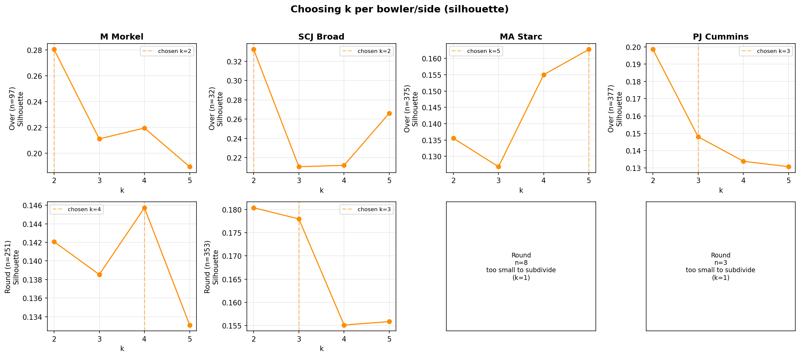
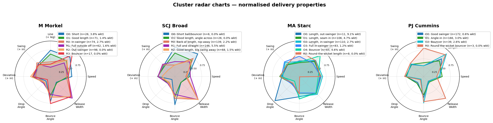
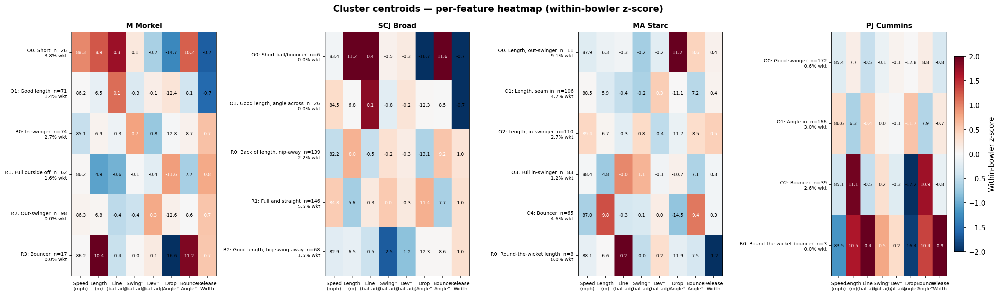

# Test Wicket Match-Ups: EDA & Clustering

## The Dataset

The file contains **1,950 ball deliveries** from four specific Test match batter-bowler match-ups, covering 51 matches.

| Bowler | Style | Batter | Deliveries |
|---|---|---|---|
| PJ Cummins | Right Fast | JE Root | 560 |
| SCJ Broad | Right Fast/Medium | DA Warner | 530 |
| M Morkel | Right Fast | Sir AN Cook | 451 |
| MA Starc | Left Fast | BA Stokes | 409 |

These are "wicket match-ups" — pairings in which the bowler dismissed the batter at least once. The dataset includes all deliveries in those contexts, not just dismissal balls. **49 of the 1,950 balls resulted in a wicket (2.5%).**

---

## Exploratory Data Analysis

### Delivery characteristics

All 1,950 deliveries are pace. The bulk sit in two length zones: **length ball** (45%) and **back of a length / short** (27%). Full deliveries make up ~12%.

| Length | Count | % |
|---|---|---|
| Length Ball | 879 | 45% |
| Back of a Length | 288 | 15% |
| Short | 230 | 12% |
| Full | 166 | 9% |
| Half Volley | 60 | 3% |
| Bouncer | 30 | 2% |
| Yorker | 27 | 1% |

**Line**: 54% target off stump or outside off; middle stump is the most common single line (33%).

**Movement**: 70% of deliveries show no recorded swing or seam. When movement occurs, seam away and away swing dominate.

**Speed**: Mean release speed is **86 mph** (std 3.3 mph). Seven deliveries recorded below 75 mph are tracking errors and are excluded from clustering.

**Ball age**: Median 134 balls (range 1–554).

### Wickets

| Bowler | Wickets |
|---|---|
| SCJ Broad | 15 |
| MA Starc | 14 |
| PJ Cummins | 13 |
| M Morkel | 7 |

**How out**: Caught (65%), bowled (20%), LBW (12%). Length ball accounts for 57% of dismissal balls.

---

## Clustering

### Approach

Rather than one global clustering, deliveries are clustered **separately for each bowler**. This finds each bowler's individual delivery repertoire rather than archetypes averaged across all four bowlers.

**Features** — eight delivery properties, bat-hand adjusted where relevant (positive = into the batter, negative = away):

| Feature | What it captures |
|---|---|
| Release Speed (mph) | Pace at the point of release |
| Bounce Length (m) | Pitch location — higher = shorter delivery |
| Bounce Line — bat-hand adjusted (m) | Lateral pitch position relative to batter's stance |
| Swing (°) — bat-hand adjusted | Air movement before pitching |
| Deviation (°) — bat-hand adjusted | Seam movement off the pitch |
| Drop Angle (°) | Steepness of ball flight as it arrives at the pitch |
| Bounce Angle (°) | Angle of rise after pitching — steep vs skiddy |
| Release Width (m) | Lateral position at release — captures arm angle, and crucially **which side of the stumps the bowler releases from (over vs. round the wicket)** |

Excluded: stumps height (trajectory endpoint); release angle (corr 0.56 with drop angle — redundant); speed loss (corr 0.57 with bounce angle); bounce ratio (corr 0.70 with bounce angle — a function of the entry and exit angles, so redundant given both angles are included); release height (std 0.09 m — negligible variation); landing X/Y (wides only); intercept metrics (43% coverage). No de-meaning is needed since we cluster within each bowler's deliveries.

#### Splitting by over/round the wicket first

Release Width is bimodal for every bowler — it's not really a continuous dial, it's a **discrete choice of release point**: bowling over the wicket or round the wicket. Running k-means on the raw feature directly produced clusters that occasionally **mixed deliveries from both sides of the stumps** (e.g. a "bouncer" cluster containing both an over-the-wicket and a round-the-wicket bouncer) — physically two different actions lumped into one group.

To fix this, each bowler's deliveries are first split by the **sign of Release Width** into:
- **Over** — bowled from over the wicket
- **Round** — bowled from round the wicket

Which sign of Release Width means "over" vs "round" depends on the **batter's handedness**: Starc and Cummins bowl at right-handed batters (Stokes, Root), so for them Over is also their majority/stock side (n=375 and n=377). Morkel and Broad bowl at left-handed batters (Cook, Warner), which flips the sign convention — for them, Over is their *minority* side (n=97 and n=32), with Round (n=251 and n=353) the side used for the majority of deliveries.

K-means is then run **independently within each side**, with k chosen via silhouette score (or fixed at k=1 if a side has too few deliveries to subdivide meaningfully — under 10 deliveries). This guarantees every cluster is homogeneous in over/round terms by construction.

| Bowler | Over side | Over n | Over k | Round side | Round n | Round k |
|---|---|---|---|---|---|---|
| M Morkel | close to stumps | 97 | 2 | wide of crease | 251 | 4 |
| SCJ Broad | close to stumps | 32 | 2 | wide of crease | 353 | 3 |
| MA Starc | wide of crease | 375 | 5 | close to stumps | 8 | 1 |
| PJ Cummins | close to stumps | 377 | 3 | wide of crease | 3 | 1 |

Clusters are labelled **O0, O1, …** (Over side) and **R0, R1, …** (Round side).

### Choosing k per side

For each bowler/side with enough deliveries (≥10), silhouette score is plotted for k = 2–5; the dashed line marks the chosen k. Sides too small to subdivide (Starc Round, n=8; Cummins Round, n=3) are shown as a single group (k=1) — these were already flagged as anomalies/outliers in earlier passes and remain so here.

Key observations:
- For Starc and Cummins, the large "Over" side supports k=3–5, with silhouette scores broadly similar to the single-clustering pass before (0.13–0.18) — no dramatic elbow, soft natural boundaries between delivery types. Morkel and Broad's large "Round" side (n=251, n=353) shows the same pattern, at k=4 and k=3 respectively.
- Morkel and Broad's smaller "Over" side has **higher silhouette scores than their Round side** (Morkel 0.28 at k=2, Broad 0.33 at k=2) — when these bowlers go over the wicket to a left-handed batter (their less-used angle in this match-up), the resulting deliveries are if anything *more* distinct from each other than their round-the-wicket stock deliveries.
- Starc's Round side (n=8) and Cummins' Round side (n=3) remain too small to subdivide — same handful of deliveries flagged as tracking anomalies/outliers previously.

### Cluster radar charts

Each spoke is one of the 8 delivery features, min-max normalised across the full dataset so shapes are directly comparable across bowlers. The legend shows side (Over/Round), cluster index, size and wicket rate. Clusters that extend further out on a spoke deliver more of that property relative to the dataset range.

### Centroid heatmaps

Cell colour shows the within-bowler z-score (red = above the bowler's average; blue = below), computed against each bowler's overall mean/SD across both sides so Over and Round rows are directly comparable; the number printed in each cell is the actual centroid value in original units. Rows are grouped Over clusters first, then Round clusters, each labelled with n and wicket rate.

---

## M Morkel — Over k=2 (n=97), Round k=4 (n=251)

> **Expert naming note**: a bowling expert reviewed these six clusters and named them using standard bowling-convention terms (in-swinger/out-swinger = the bowler's natural swing direction, regardless of who's batting). Because Morkel bowls to a left-hander, this is the *opposite* sense to the bat-hand-adjusted "seams away from / into the batter" language used elsewhere in this report — "seams away from the batter" (R0) is, from Morkel's own arm, an **in-swinger**, and "seams into the batter" (R2) is an **out-swinger**. The two framings agree on the underlying ball; only the reference point (batter vs. bowler) differs. Expert names are given alongside the original descriptions below.

### O0 — Short, Over the Wicket (n=26, **3.8%**)

*Expert label: "Short"*

Back-of-a-length to short (8.86 m), steep angles (−14.7°, 10.3°), seaming away (−0.73°). **Highest wicket rate of any Morkel cluster** — one caught wicket from 26 balls. The over-the-wicket short ball angled across the left-hander.

### O1 — Good Length, Over the Wicket (n=71, 1.4%)

*Expert label: "Good length"*

Good length (6.48 m), leg-side line (+0.07), mild away swing (−0.33°). One caught wicket. The body-line good-length delivery from over the wicket to a left-hander.

### R0 — In-Swinger, Good Length (n=74, 2.7%)

*Expert label: "In-swinger"*

Good length (6.88 m), in-swing through the air (+0.66°) but seaming away from the batter off the pitch (−0.82°, i.e. seaming back towards Morkel's natural in-swing) — drifts in then cuts back. Newer ball (137 balls). Two wickets: caught and LBW, from a forward and backward defensive. The ball that threatens both edges.

### R1 — Full, Outside Off (n=62, 1.6%)

*Expert label: "Full outside off"*

Fuller length (4.93 m), off-stump line (−0.57), mild away movement. Yorkers and full balls alongside length balls, ball age 170. One caught wicket off a drive. Morkel's stock full ball.

### R2 — Out-Swinger, Good Length (n=98, 0.0%)

*Expert label: "Out-swinger"*

Morkel's biggest single cluster. Good length (6.81 m), off-stump (−0.44), seaming into the batter (+0.33°, i.e. away from Morkel's arm — his out-swinger) with mild away swing through the air. **Zero wickets** — pure containment, probing the stumps without reward in this match-up.

### R3 — Bouncer, Round the Wicket (n=17, 0.0%)

*Expert label: "Bouncer"*

Short (10.36 m), steep drop and bounce angles (−16.6°, 11.2°). A small round-the-wicket short-ball/bouncer variant — no wickets from 17 deliveries.

**Morkel in summary**: Splitting by release side first reveals that Morkel's **highest wicket-rate delivery (O0, 3.8%) is an over-the-wicket short ball** — a genuinely different release point, not just a different length. His seam-in good-length ball (R2) is bowled often but takes no wickets here — pure containment. The round-the-wicket repertoire (R0–R3), his stock angle to this left-hander, covers seam-away, full, seam-in and a small short-ball variant.

---

## SCJ Broad — Over k=2 (n=32), Round k=3 (n=353)

> **Expert naming note**: a bowling expert reviewed these five clusters too. Unlike Morkel's, these names line up directly with the descriptions below — no batter/bowler reference-point flip needed here.

### O0 — Short Ball / Bouncer, Over the Wicket (n=6, 0.0%)

*Expert label: "Short ball/bouncer"*

Tiny cluster (n=6): extreme bounce length (11.16 m), steepest angles (−16.7°, 11.6°), oldest ball (104 balls). Too small to draw conclusions — Broad rarely goes over the wicket to this left-hander, and almost never short when he does.

### O1 — Good Length, Angled Across the Batter (n=26, 0.0%)

*Expert label: "Good length, angle across batter"*

Good length (6.81 m), leg-side line (+0.12), away swing (−0.83°), ball age 66. Zero wickets from 26 balls — an awkward angle variant of the outswinger that hasn't converted here.

### R0 — Back of a Length, Nip-Away (n=139, 2.2%)

*Expert label: "Back of a length/nip-away"*

Back-of-a-length (7.99 m), off-stump (−0.47), wobble seam and mixed movement. New ball (53 balls). Three caught wickets — unpredictable movement at back-of-a-length.

### R1 — Full and Straight (n=146, **5.5%**)

*Expert label: "Full and straight"*

Full length (5.65 m), very new ball (36 balls), straight line. Length balls, full balls, half volleys and yorkers. **Broad's standout wicket-taking cluster — 8 wickets**: LBW (3), caught (3), bowled (2). The full straight ball with the new ball is comfortably his most lethal mode, and his most-used new-ball option (146 of 196 new-ball-ish deliveries).

### R2 — Good Length, Big Swing Away (n=68, 1.5%)

*Expert label: "Good length, big swing away"*

Strong away swing (−2.47°) and seam away (−1.17°), good length (6.53 m), new ball (48 balls). Broad's conventional outswinger. One caught wicket — creates pressure and edge risk but converts less often against these left-handers.

**Broad in summary**: The new ball (under ~55 balls) is overwhelmingly his dangerous phase, and within it the **full straight ball (R1) is now even more dominant than previously found — 5.5% wicket rate across 146 deliveries, 8 of his 15 wickets**. The wobble-seam back-of-length (R0) is his secondary wicket-taker. Both over-the-wicket clusters (O0, O1) are rarely used and have taken no wickets in this match-up.

---

## MA Starc — Over k=5 (n=375), Round k=1 (n=8)

> **Note**: O0 (n=11) has a positive Drop Angle (+11.2°), which is physically impossible — a ball cannot be rising when it hits the pitch. This is almost certainly a Hawk-Eye tracking anomaly for these 11 deliveries, carried over unchanged from the earlier clustering. R0 (n=8, all of Starc's round-the-wicket deliveries) is too small to subdivide and is reported but not over-interpreted.

> **Expert naming note**: a bowling expert named these six clusters too — see the *Expert label* lines below. For O0, the expert's "length out swinger" describes the cluster's swing/seam characteristics, which are independent of the impossible drop angle; we keep both descriptions, but the tracking-anomaly caveat still applies.

### O0 — Length, Out-Swinger (n=11, 9.1%)

*Expert label: "Length out swinger"*

Positive drop angle (+11.2°) — physically impossible, flagged as a tracking artefact. Excluded from the main narrative.

### O1 — Length, Seam In (n=106, **4.7%**)

*Expert label: "Length seam in"*

Full-ish length (5.93 m), old ball (226 balls), slight away movement through the air with seam back in. Length balls, full balls and half volleys. **Five wickets, all bowled, four via drives** — the old-ball full delivery that's drawing the batter forward and beating the bat or castling the stumps. Likely reverse-swing territory given the ball age.

### O2 — Length, In-Swinger (n=110, 2.7%)

*Expert label: "Length in-swinger"*

Starc's largest cluster. Good length (6.75 m), in-swing through the air (+0.84°) with away seam (−0.39°), fastest of the main clusters (89.4 mph), old ball (196 balls). Three caught wickets. The high-volume stock ball.

### O3 — Full In-Swinger (n=83, 1.2%)

*Expert label: "Full in-swinger"*

Very full (4.80 m), strong in-swing (+1.14°), oldest ball (250 balls). Yorkers (11) and half volleys (10) feature heavily. One bowled wicket from a drive. The classic left-arm reverse in-swinging yorker.

### O4 — Bouncer (n=65, **4.6%**)

*Expert label: "Bouncer"*

Short to back-of-a-length (9.80 m), steep angles (−14.5°, 9.4°), minimal movement, old ball (238 balls). Three caught wickets from a cut, pull and backward defensive. Starc's short-ball variation, used almost exclusively with the old ball.

### R0 — Round-the-Wicket Length (n=8, 0.0%)

*Expert label: "Round the wicket length"*

All 8 of Starc's round-the-wicket deliveries (Release Width −1.25), mixed lengths, no recorded movement, old ball (243 balls). Too small (n=8) to interpret as a deliberate tactic — almost certainly occasional variation rather than a planned mode.

**Starc in summary**: Every meaningful cluster is old-ball bowling (196+ balls) — consistent with Starc operating almost entirely as a second/reverse-swing-phase bowler in this match-up. **The old-ball full delivery (O1, 4.7%, all 5 wickets bowled via drives)** and the **short ball (O4, 4.6%)** are his two most productive modes; the in-swinging yorker (O3) and stock good-length (O2) are higher-volume but lower-strike-rate. The anomalous clusters (O0, R0) together account for 19 deliveries and shouldn't be read as tactical modes.

---

## PJ Cummins — Over k=3 (n=377), Round k=1 (n=3)

> **Note**: R0 (n=3) is Cummins' entire round-the-wicket sample in this match-up — three short deliveries, too small to interpret as a deliberate tactic.

> **Expert naming note**: a bowling expert named these four clusters too — see the *Expert label* lines below.

### O0 — Good Swinger (n=172, 0.6%)

*Expert label: "Good swinger"*

Cummins' largest cluster. Back-of-a-length (7.75 m), off-stump (−0.50), minimal movement, ball age 176. One caught wicket from 172 balls (0.6%) — his lowest-strike-rate, highest-volume mode. Pure pressure-building.

### O1 — Angle In (n=166, **3.0%**)

*Expert label: "Angle-in"*

Good length (6.33 m), off-stump (−0.35), ball age 185. More full balls and half volleys mixed in than O0. **Five wickets**: bowled (2), caught (2), LBW (1) — Cummins' main wicket-taking length, fuller and more varied than the back-of-length stock ball.

### O2 — Bouncer (n=39, 2.6%)

*Expert label: "Bouncer"*

Very short (11.05 m), steepest angles (−17.2°, 10.9°), ball age 199. One caught wicket from a backward defensive. The aggressive short-pitched option.

### R0 — Round-the-Wicket Bouncer (n=3, 0.0%)

*Expert label: "Round the wicket bouncer"*

Cummins' only three round-the-wicket deliveries — short, no movement, zero wickets. Far too small to read into.

**Cummins in summary**: The split shows two clearly different "lengths" rather than one dominant mode: a **high-volume, low-reward back-of-length containment ball (O0)** and a **fuller, more varied good-length ball (O1) that does almost all the wicket-taking work (5 of his 6 clustered wickets)**. The short ball (O2) is a minor third option. Round-the-wicket bowling (R0) is essentially absent from this match-up.

---

## Cross-Bowler Takeaways

1. **Splitting by over/round the wicket surfaced a new headline result for Morkel**: his highest wicket-rate cluster (O0, 3.8%) is an over-the-wicket short ball — a different release point, not just a different length, and invisible in the single-clustering pass.

2. **Broad's full ball with the new ball (R1, 5.5%, n=146) is the standout wicket-taking delivery across all four bowlers** — 8 wickets from one cluster, all with the ball under ~55 balls old.

3. **Starc and Cummins are essentially one-sided bowlers in this dataset** (375/383 and 377/380 deliveries from their stock side respectively). Their tiny "Round" groups (8 and 3 deliveries) are reported for completeness but are too small to represent a deliberate tactical option.

4. **Ball age remains a major dividing line**: Broad's wicket-taking clusters use a ball under ~55 balls old; Starc's entire repertoire is 196+ balls; Morkel and Cummins sit in between.

5. **Cummins shows a clean two-length split**: a high-volume back-of-length containment ball (O0, 0.6% wickets) vs. a fuller, more attacking good-length ball (O1, 3.0%, 5 of his 6 clustered wickets) — length, not line or movement, is what separates his modes.

6. **The Morkel/Starc tracking anomaly persists**: Starc's O0 (n=11, positive drop angle) is a physically impossible Hawk-Eye reading carried over from the earlier analysis, included for completeness but excluded from interpretation.
