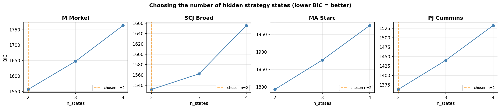
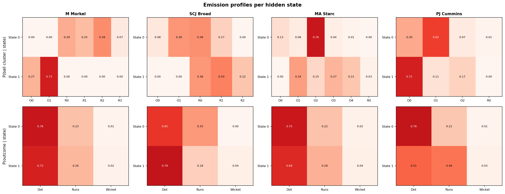
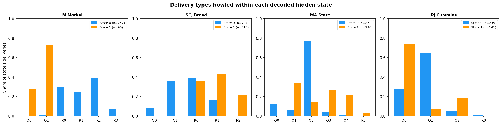
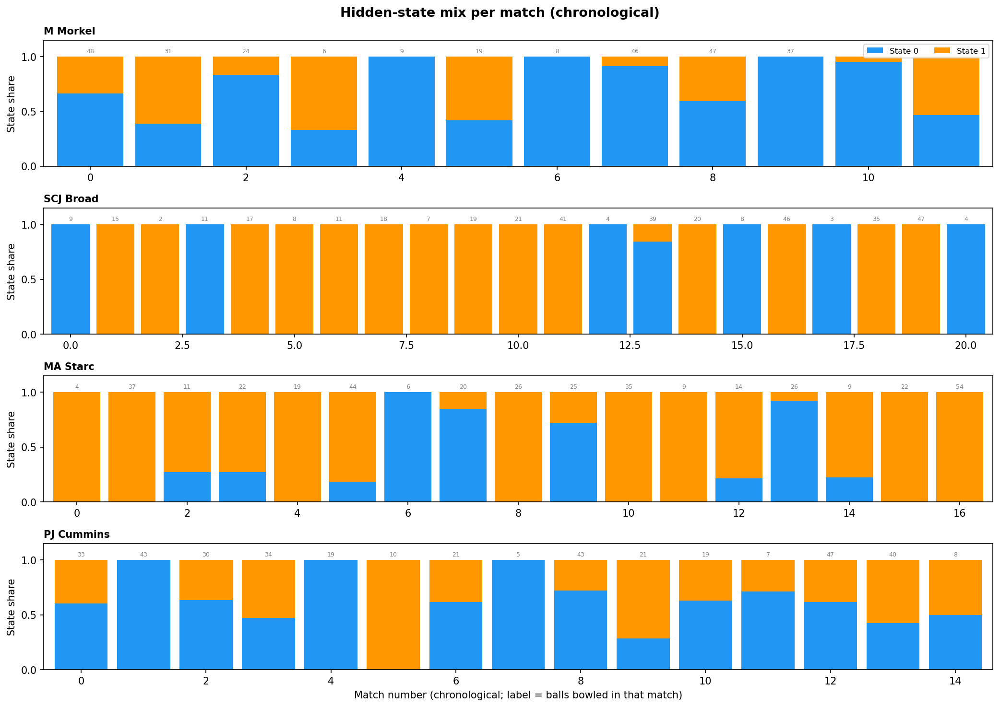
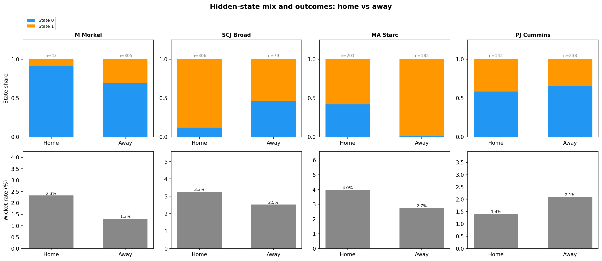

# Modelling Bowling "Strategy" with Hidden Markov Models

## The idea

The k-means analysis (`analysis.md`) found each bowler's repertoire of **delivery types** (clusters), based purely on the physical properties of the ball (speed, length, line, swing, seam, angles). That analysis treats every delivery independently — it has no notion of time or sequence. This document uses **exactly the same clusters** (the over/round-the-wicket split, e.g. Morkel's O0 "Short", R2 "Out-swinger", etc., with the same expert-given names) — so a cluster name means the same thing in both documents.

In reality, a bowler doesn't pick each ball at random. Across an over or a spell they tend to settle into a **plan** — e.g. "attack the stumps with the new ball" or "bowl tight and build pressure" — and that plan shapes which delivery types and outcomes show up in a run of consecutive balls. We can't observe the plan directly, but we can observe its consequences: which cluster each ball belongs to, and what happened (dot ball / runs / wicket).

This is exactly the setup a **Hidden Markov Model (HMM)** is designed for ([background reading](https://luisdamiano.github.io/BayesHMM/articles/introduction.html)):

- A small number of **hidden states** represent the bowler's underlying "strategy" at each point in time.
- A **transition matrix** describes how likely the bowler is to stay in the same strategy from ball to ball, or switch to another.
- An **emission distribution** describes what we expect to observe (cluster + outcome) given the current hidden strategy.

Given a sequence of observations, we can fit these three pieces and then run the **Viterbi algorithm** to decode the most likely hidden-strategy sequence underlying each bowler's deliveries.

### Bayesian vs. simple fitting

The BayesHMM article fits this model fully Bayesian (Stan, MCMC, priors on every parameter). That's the rigorous way to do it, but it's a lot of machinery for ~350-560 observations per bowler. In keeping with "nothing fancy", this analysis fits the **same model structure** (categorical HMM: discrete states, discrete observations) using the standard **Baum-Welch / EM algorithm** (`hmmlearn`'s `CategoricalHMM`), which gives maximum-likelihood estimates of the same π (initial probabilities), A (transition matrix) and θ (emission probabilities). The interpretation — filtering, smoothing, Viterbi decoding — is identical; we're just using point estimates instead of posterior distributions.

---

## Data preparation

For each of the four bowlers, every delivery is reduced to a single observed **symbol**:

**symbol = (ball cluster) × (outcome)**

- **Ball cluster**: the per-bowler over/round-the-wicket-split cluster from `analysis.md` (4–6 clusters depending on bowler, e.g. O0/O1/.../R0/R1/...), capturing *what kind of ball it was*. The HMM's "alphabet size" (`n_clusters x 3` outcomes) is therefore the same total cluster count as in `analysis.md`: Morkel 6, Broad 5, Starc 6, Cummins 4.
- **Outcome**: one of three categories capturing *what happened*:
  - **Dot** — no runs conceded, no wicket
  - **Runs** — runs conceded off the bat, no wicket
  - **Wicket** — the bowler took the wicket

Deliveries are ordered **chronologically** (match start date → innings → over → ball), so the HMM sees each bowler's deliveries in the order they were actually bowled, across all 51 matches in the dataset. The 7 tracking-error deliveries (<75 mph) excluded from the clustering are excluded here too.

### Strategies reset each match

A bowler doesn't carry a "strategy" across a gap of weeks or months between Test matches — whatever plan he had going into the last ball of one match has no bearing on the first ball of the next. Originally this analysis concatenated all of a bowler's deliveries into one long sequence and let the HMM model transitions across match boundaries too, which implicitly assumes the strategy *can* carry over from the last ball of match N to the first ball of match N+1.

To fix this, each bowler's deliveries are still placed in one long chronological array (348–385 symbols, alphabet size `n_clusters × 3` = 12–18), but `hmmlearn` is given a `lengths` array marking where each of the bowler's matches starts and ends. This means:

- The **transition matrix** `A` is only ever applied *within* a match — there's no learned transition from the last ball of one match to the first ball of the next.
- The **start probabilities** π are applied at the start of *every* match, not just once at the start of the whole sequence — so π now has a real interpretation: "what state does this bowler tend to begin a match in?"
- The **emission distributions** are still shared and fit across all matches (pooling data for statistical power), but decoding (Viterbi) is run match-by-match.

This is a standard way to handle multiple independent sequences with a single HMM, and it directly answers the question of whether a bowler's "starting strategy" is consistent match-to-match (persistent) or essentially reset/random.

---

## Choosing the number of hidden states

We fit the HMM separately for each bowler with **2, 3, and 4 hidden states** (10 random restarts each, keeping the best-likelihood fit), and compare them with the **Bayesian Information Criterion (BIC)**, which penalises extra parameters — useful here because more states quickly add a lot of emission parameters relative to the amount of data.

For **all four bowlers, BIC is still minimised at 2 states** under the per-match-sequence model, and rises steadily for 3 and 4. With only a few hundred balls per bowler split across 12–21 matches, a **two-state "strategy"** model is about as much structure as the data can support.

All results below use **2 hidden states per bowler**. States are relabelled (after fitting) in order of "aggression" — `State 0` is the lower-wicket/lower-runs state, `State 1` the higher one — purely so the two states can be compared consistently across the figures. Note that this relabelling means `State 0`/`State 1` here are not necessarily the "same" states as in the previous (concatenated) version of this analysis — the underlying model has been refit from scratch with the new per-match constraint, and for some bowlers the resulting states represent quite different things (see Starc and Cummins below).

---

## Results

The timeline plot shows the Viterbi-decoded state for every delivery in chronological order (★ = wicket); the thin grey dotted lines mark **match boundaries** — the HMM resets to its start distribution at each one, and no transition is modelled across them. The emission plot shows, for each state, the model's *fitted* probability of bowling each ball cluster (top row) and each outcome (bottom row). The histogram below it shows the same idea from the *decoded* side: for each bowler, it takes every delivery the Viterbi path actually assigned to State 0 / State 1, and plots what share of those deliveries were each cluster. Cluster codes (O0, O1, R0, ...) are the same ones used in `analysis.md` — see each bowler's table below for what they mean.

### M Morkel

| | State 0 (72.4%, avg. run ≈ 24 balls) | State 1 (27.6%, avg. run ≈ 8 balls) |
|---|---|---|
| Dominant clusters | R0 In-swinger (29%), R1 Full outside off (25%), R2 Out-swinger (39%), R3 Bouncer (7%) | O0 Short (27%), O1 Good length (73%) |
| Outcome | Dot 76%, Runs 23%, Wicket 1% | Dot 72%, Runs 26%, Wicket 2% |
| Starts a match in this state | 7 / 12 matches | 5 / 12 matches |

With the same clusters as `analysis.md`, Morkel's two "strategies" line up almost exactly with his **over/round-the-wicket split**. State 0 is entirely built from his **round-the-wicket repertoire** (in-swinger, full outside off, out-swinger, bouncer — i.e. R0–R3), in long runs of ~24 balls. State 1 is entirely his **over-the-wicket** pair (short, good length — O0/O1), in shorter ~8-ball bursts. Both are common starting points (7/12 matches start round the wicket, 5/12 over the wicket), and outcomes are similar in both (Dot ~75%, Wicket 1–2%) — so this isn't an "attack vs. contain" split so much as a **wicket-position switch**: spells of round-the-wicket variety, punctuated by shorter spells of over-the-wicket length bowling.

### SCJ Broad

| | State 0 (18.7%, ~match-length runs) | State 1 (81.3%, ~match-length runs) |
|---|---|---|
| Dominant clusters | O1 Good length, angle across (36%), R0 Back of length, nip-away (38%), R1 Full and straight (17%), O0 Short ball/bouncer (8%) | R1 Full and straight (43%), R0 Back of length, nip-away (36%), R2 Good length, big swing away (22%) |
| Outcome | Dot 65%, Runs 35%, Wicket 0% | Dot 78%, Runs 18%, **Wicket 4%** |
| Starts a match in this state | 6 / 21 matches | 15 / 21 matches |

Both states are **near-absorbing** (transition matrix ≈ `[[1.00, 0.00], [0.004, 0.996]]`) — once a match settles into a state it essentially stays there, so this is best read as a **match-level mode** rather than something that switches mid-spell (see `hmm_match_states.png`: almost every bar is ~100% one colour). State 1 — 81% of deliveries, 15/21 matches — is built entirely from his **round-the-wicket trio** (back of length nip-away, full and straight, big swing away) and carries his **entire wicket return** (4% vs 0%). State 0 — the minority mode, 6/21 matches — is a broader mix that also pulls in his over-the-wicket short ball/bouncer and good-length-angle-across deliveries, and has produced no wickets at all in this dataset. In short: in matches where Broad goes predominantly round the wicket, that's also where his wickets come from.

### MA Starc

| | State 0 (22.7%, avg. run ≈ 11 balls) | State 1 (77.3%, absorbing once entered) |
|---|---|---|
| Dominant clusters | O2 Length, in-swinger (76%), O0 Length, out-swinger (13%), O1 Length, seam in (6%), O3 Full in-swinger (4%) | O1 Length, seam in (34%), O3 Full in-swinger (27%), O4 Bouncer (21%), O2 Length, in-swinger (15%), R0 Round-the-wicket length (3%) |
| Outcome | Dot 75%, Runs 22%, Wicket 2% | Dot 69%, Runs 28%, **Wicket 4%** |
| Starts a match in this state | 9 / 17 matches | 8 / 17 matches |

The transition matrix (`[[0.91, 0.09], [0.00, 1.00]]`) makes State 1 a one-way absorbing state: a match can move from State 0 to State 1, but never back. State 0 is a **tight, repetitive opening** dominated almost entirely by the length in-swinger (O2, 76%); after an expected ~11 balls, the model transitions (one-way) into State 1, a **broader mix** of seam-in, full in-swinger and bouncer deliveries with roughly double the wicket rate (4% vs 2%). About half of matches (8/17) start directly in this broader State 1 mix rather than the tight in-swinger opening. *Caveat*: `analysis.md` notes that O0 (Length, out-swinger) contains a handful of deliveries with an anomalous (physically implausible) positive Drop Angle reading — a small Hawk-Eye tracking artefact, not a genuine delivery type — which sits inside State 0's 13% O0 share.

### PJ Cummins

| | State 0 (62.9%, avg. run ≈ 9 balls) | State 1 (37.1%, avg. run ≈ 7 balls) |
|---|---|---|
| Dominant clusters | O1 Angle-in (62%), O0 Good swinger (30%), O2 Bouncer (7%) | O0 Good swinger (72%), O2 Bouncer (17%), O1 Angle-in (11%) |
| Outcome | Dot 78%, Runs 21%, Wicket 1% | Dot 51%, Runs 46%, **Wicket 3%** |
| Starts a match in this state | 13 / 15 matches | 2 / 15 matches |

The two-phase pattern from earlier versions of this analysis still holds with the shared clustering. State 0 is a **containing mix dominated by the angle-in ball** (62%), with low runs and almost no wickets (Dot 78%, Wicket 1%). State 1 swings towards the **good swinger and bouncer** (72% + 17%), conceding far more freely (Runs 46% vs 21%) while producing roughly **three times the wicket rate**. Almost all matches (13/15) open in the containing State 0, with an expected dwell of only ~9 balls before the model can switch into the more attacking State 1 — consistent with Cummins reliably starting in containment mode and the "have a go" phase developing within the match.

---

## How does the strategy mix change match-by-match?

With each match treated as its own sequence, this plot is now a direct readout of the model's per-match behaviour rather than an artefact of one long concatenated decode.

Each bar is one match (in chronological order, left to right), showing what fraction of that bowler's deliveries in that match were decoded as State 0 (blue) vs State 1 (orange). The grey number above each bar is how many deliveries that bowler bowled at this batter in that match — many matches are single-figure samples, so individual bars should be read cautiously, but the overall pattern across many matches is informative.

- **M Morkel**: a recurring mix of mostly-State-0 (round-the-wicket variety) and mostly-State-1 (over-the-wicket short/good-length) matches throughout, with both openings appearing repeatedly — consistent with **wicket-position choice being a genuine, recurring tactical variable** for Morkel against this batter, rather than a single default with occasional noise.
- **SCJ Broad**: most matches are bowled **almost entirely in one state or the other** (matching the near-absorbing transition matrix), and State 1 (his round-the-wicket trio, and entire wicket return) is by far the more common — the majority of bars are ~100% orange. A handful of matches are bowled almost entirely in State 0 instead (his broader, over-the-wicket-inclusive mix), with a couple of more mixed matches late in the sequence.
- **MA Starc**: most matches are **State-1-dominant** (the broader, higher-wicket-rate mix), either from the start or after a brief State-0 opening of the tight in-swinger length ball. A handful of matches (around a third) are instead **State-0-dominant throughout** — these are the matches where Starc kept bowling that tight in-swinger length for most or all of the spell, without the model ever switching him into the broader State 1.
- **PJ Cummins**: a clear **two-phase pattern recurs across most matches** — most matches start in State 0 (containment, angle-in heavy), and many transition into State 1 (more runs conceded, but also where most of his wickets come from) for some portion of the match. The fraction spent in State 1 varies a lot match-to-match (from 0% to 100%), but the *general order* — start in State 0, sometimes move to State 1 — is the dominant pattern.

---

## Home vs away

The dataset records whether the bowling team was playing at home, away, or (rarely) on neutral ground. This field is blank for all the England-vs-Australia (Ashes) matches, so for those we derive it from `Ground Country`: a ground in England or Wales counts as "home" for England and "away" for Australia, and vice versa for grounds in Australia.

The top row shows the State 0 / State 1 split for home vs away deliveries; the bottom row shows the overall wicket rate for home vs away (not split by state, since the per-state-per-venue samples get very small).

- **Wicket rate is higher at home for three of the four bowlers** (Morkel 2.3% vs 1.3%, Broad 3.3% vs 2.5%, Starc 4.0% vs 2.7%; Cummins is the exception at 1.4% home vs 2.1% away). This matches the general expectation that home conditions and crowd support tend to favour the bowling side.
- **Morkel bowls almost exclusively round-the-wicket (State 0) at home** (91% vs 70% away) — though his home sample is tiny (n=43, essentially one match), so this is indicative at best.
- **Broad spends much more time in his round-the-wicket, wicket-taking state (State 1) at home** (88% vs 54% away) — and his home wicket rate is also higher (3.3% vs 2.5%), consistent with more time spent in the state that carries his entire wicket return.
- **Starc is in State 1 (the broader, higher-wicket-rate mix) almost the entire time away** (98% vs 58% at home) — yet his *away* wicket rate is lower (2.7% vs 4.0%). So spending more time in the "higher wicket rate" state doesn't translate into more wickets away — the home/away gap must come from within-state differences (e.g. conditions, batter familiarity), not the state mix itself.
- **Cummins spends somewhat more time in his attacking state (State 1) at home** (42% vs 34% away) — yet his *away* wicket rate is higher (2.1% vs 1.4%). This suggests that away from home, the spells he does spend in State 1 are more productive per ball, even though he spends less total time there.

---

## Caveats

- **Sample size**: 350–560 balls per bowler, split across 12–21 matches, is small for HMM fitting — many matches contribute only a handful of observations to the per-match decoding. This is part of why BIC favours the simplest (2-state) model everywhere.
- **The "strategies reset each match" assumption is itself a modelling choice**, not a certainty — international bowlers do carry plans and form across a series (e.g. "this batter struggled against X last time, do it again"). Treating matches as fully independent is a reasonable simplification, but match-to-match continuity (captured in the previous version's cross-match transitions) is not literally zero.
- **The states are descriptive, not causal.** The HMM finds statistical regimes in the sequence; it doesn't know *why* the regime changed (new ball, declaration tactics, a different batter on strike, fatigue, etc.).
- **Label switching**: hidden states from EM have no inherent ordering. States were sorted by an "aggression score" (wicket rate ×10 + runs rate) purely so State 0/State 1 mean roughly the same thing across bowlers, but the absolute values are not directly comparable across bowlers (each HMM was fit independently).
- **Shared clustering with `analysis.md`**: the ball clusters feeding the HMM are now identical to the over/round-the-wicket-split clusters described and named in `analysis.md`. This makes cluster names directly comparable across both documents, but it also means the HMM's alphabet size changed slightly from earlier drafts of this analysis (most noticeably for Morkel: 6 clusters instead of 5) — so the state definitions and dominant-cluster breakdowns above are specific to this version and not directly comparable to earlier drafts.
- **Starc's O0 (Length, out-swinger)** contains a small number of deliveries with an anomalous (physically implausible) positive Drop Angle — a Hawk-Eye tracking artefact flagged in `analysis.md`, not a genuine delivery type. It's a small share of State 0 (13%) and shouldn't be over-interpreted.
