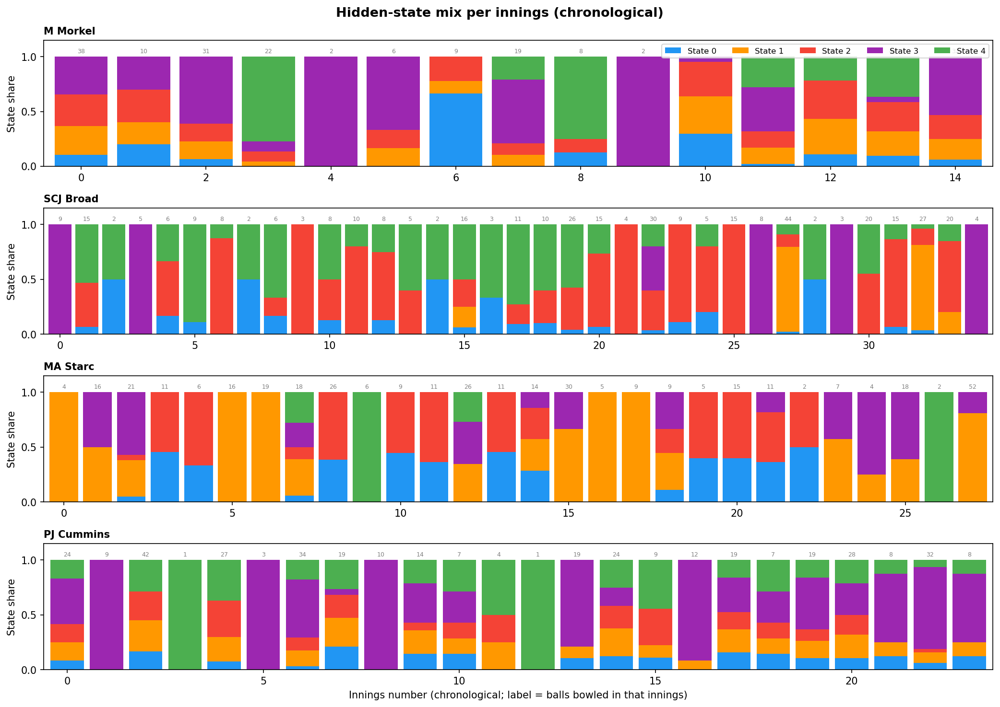

# Modelling Bowling "Strategy" with Hidden Markov Models

## The idea

The k-means analysis (`analysis.md`) found each bowler's repertoire of **delivery types** (clusters), based purely on the physical properties of the ball (speed, length, line, swing, seam, angles). That analysis treats every delivery independently — it has no notion of time or sequence. This document uses **exactly the same clusters** (the over/round-the-wicket split, e.g. Morkel's O0 "Short", R2 "Out-swinger", etc., with the same expert-given names) — so a cluster name means the same thing in both documents.

In reality, a bowler doesn't pick each ball at random. Across an over or a spell they tend to settle into a **plan** — e.g. "attack the stumps with the new ball" or "bowl tight and build pressure" — and that plan shapes which delivery types and outcomes show up in a run of consecutive balls. We can't observe the plan directly, but we can observe its consequences: which cluster each ball belongs to, and what happened (dot ball / runs / wicket).

This is exactly the setup a **Hidden Markov Model (HMM)** is designed for ([background reading](https://luisdamiano.github.io/BayesHMM/articles/introduction.html)):

- A small number of **hidden states** represent the bowler's underlying "strategy" at each point in time.
- A **transition matrix** describes how likely the bowler is to stay in the same strategy from ball to ball, or switch to another.
- An **emission distribution** describes what we expect to observe (cluster + outcome) given the current hidden strategy.

Given a sequence of observations, we can fit these three pieces and then run the **Viterbi algorithm** to decode the most likely hidden-strategy sequence underlying each bowler's deliveries.

### Bayesian vs. simple fitting

The BayesHMM article fits this model fully Bayesian (Stan, MCMC, priors on every parameter). That's the rigorous way to do it, but it's a lot of machinery for ~350-560 observations per bowler. In keeping with "nothing fancy", this analysis fits the **same model structure** (categorical HMM: discrete states, discrete observations) using the standard **Baum-Welch / EM algorithm** (`hmmlearn`'s `CategoricalHMM`), which gives maximum-likelihood estimates of the same π (initial probabilities), A (transition matrix) and θ (emission probabilities). The interpretation — filtering, smoothing, Viterbi decoding — is identical; we're just using point estimates instead of posterior distributions.

---

## Data preparation

For each of the four bowlers, every delivery is reduced to a single observed **symbol**:

**symbol = (ball cluster) × (outcome)**

- **Ball cluster**: the per-bowler over/round-the-wicket-split cluster from `analysis.md` (4–6 clusters depending on bowler, e.g. O0/O1/.../R0/R1/...), capturing *what kind of ball it was*. The HMM's "alphabet size" (`n_clusters × 4` outcomes) is therefore 4× the total cluster count from `analysis.md`: Morkel 24, Broad 20, Starc 24, Cummins 16.
- **Outcome**: one of four categories capturing *what happened*:
  - **Dot** — no runs conceded, no wicket
  - **Runs** — runs conceded off the bat, no wicket
  - **Chance** — a wicket *should* have happened but didn't: a dropped catch, missed run-out, or keeper error (`Fielder Action` = Dropped Catch / Run Out Chance / Keeper Error), with `Is Wicket` False
  - **Wicket** — the bowler took the wicket

Chances are very rare (0–4 per bowler) but worth its own category: a state's raw "Wicket" rate can understate how close it actually came to producing a wicket if a chance went begging. Adding this category does mean the alphabet is noticeably bigger (16–24 symbols vs 12–18 previously), which is part of why BIC values in this version are higher across the board — there are simply more emission probabilities to estimate.

Deliveries are ordered **chronologically** (match start date → innings → over → ball), so the HMM sees each bowler's deliveries in the order they were actually bowled, across all 51 matches in the dataset. The 7 tracking-error deliveries (<75 mph) excluded from the clustering are excluded here too.

### Strategies reset each innings

A bowler doesn't carry a "strategy" across a gap of weeks or months between Test matches — or even across the gap between bowling in the first innings of a match and coming back for the second. Whatever plan he had going into the last ball of one innings has no bearing on the first ball of the next. Originally this analysis concatenated all of a bowler's deliveries into one long sequence (or, in an earlier version, split only at match boundaries) and let the HMM model transitions across those gaps too, which implicitly assumes the strategy *can* carry over.

To fix this, each bowler's deliveries are still placed in one long chronological array (348–385 symbols, alphabet size `n_clusters × 3` = 12–18), but `hmmlearn` is given a `lengths` array marking where each of the bowler's **innings** (not just matches) starts and ends — splitting on (Match ID, Innings ID) rather than just Match ID. A bowler can appear in both innings of the same Test, so this gives noticeably more (shorter) sequences per bowler than splitting by match alone: 15 innings for Morkel (vs 12 matches), 35 for Broad (vs 21), 28 for Starc (vs 17), and 24 for Cummins (vs 15). This means:

- The **transition matrix** `A` is only ever applied *within* an innings — there's no learned transition from the last ball of one innings to the first ball of the next.
- The **start probabilities** π are applied at the start of *every* innings, not just once at the start of the whole sequence — so π now has a real interpretation: "what state does this bowler tend to begin an innings in?"
- The **emission distributions** are still shared and fit across all innings (pooling data for statistical power), but decoding (Viterbi) is run innings-by-innings.

This is a standard way to handle multiple independent sequences with a single HMM, and it directly answers the question of whether a bowler's "starting strategy" is consistent innings-to-innings (persistent) or essentially reset/random.

---

## Choosing the number of hidden states

We fit the HMM separately for each bowler with **2, 3, 4, and 5 hidden states** (15 random restarts each, keeping the best-likelihood fit), and compare them with the **Bayesian Information Criterion (BIC)**, which penalises extra parameters — useful here because more states quickly add a lot of emission parameters relative to the amount of data.

For **all four bowlers, BIC is minimised at 2 states** and rises steadily and substantially through 3, 4 and 5 (e.g. Morkel goes from 1620.1 at 2 states to 2061.9 at 5). Statistically, a two-state model is about as much structure as 350–560 balls per bowler can support — at 5 states, several states are decoded from only a handful of innings, so they should be read as suggestive rather than well-estimated.

**Despite that, the results below deliberately use 5 hidden states per bowler.** The 2-state model (used in earlier drafts of this analysis) turned out to map almost exactly onto each bowler's **over/round-the-wicket split** — interesting, but it doesn't tell us much about *strategy* beyond "which side of the stumps". The aim of pushing to 5 states is to see whether, underneath that dominant split, there's any finer-grained structure — e.g. different "modes" *within* a bowler's round-the-wicket spells, or a short-lived high-wicket "strike" state that a 2-state model would average away. As the BIC plot shows, this is a **deliberate trade of statistical parsimony for exploratory detail** — treat the small, rarely-occupied states (anything under ~10% occupancy) as a hint to investigate further with more data, not a confirmed finding.

States are relabelled (after fitting) in order of "aggression" (wicket rate ×10 + chance rate ×5 + runs rate) — `State 0` is the most defensive, `State 4` the most aggressive — purely so states can be compared consistently across the figures. Chances are weighted at half a wicket: a near-miss is more "aggressive" than a plain run conceded, but less than an actual wicket. This relabelling means `State 0`...`State 4` here are not the "same" states as in earlier versions of this analysis — the model has been refit from scratch each time.

---

## Results

The timeline plot shows the Viterbi-decoded state for every delivery in chronological order (★ = wicket); the thin grey dotted lines mark **innings boundaries** — the HMM resets to its start distribution at each one, and no transition is modelled across them (whether between the two innings of the same match or across different matches). The emission plot shows, for each state, the model's *fitted* probability of bowling each ball cluster (top row) and each outcome (bottom row). The histogram below it shows the same idea from the *decoded* side: for each bowler, it takes every delivery the Viterbi path actually assigned to State 0 / State 1, and plots what share of those deliveries were each cluster. Cluster codes (O0, O1, R0, ...) are the same ones used in `analysis.md` — see each bowler's table below for what they mean.

### M Morkel

| | State 0 (11.2%, ~1.8 balls) | State 1 (20.4%, ~1 ball) | State 2 (22.7%, ~1 ball) | State 3 (27.6%, ~9 balls) | State 4 (18.1%, ~14.6 balls) |
|---|---|---|---|---|---|
| Dominant clusters | R0 In-swinger (69%), R2 Out-swinger (31%) | R1 Full outside off (30%), R2 Out-swinger (66%) | R0 In-swinger (36%), R2 Out-swinger (45%), R3 Bouncer (13%) | O0 Short (27%), O1 Good length (73%) | R0 In-swinger (24%), R1 Full outside off (61%) |
| Outcome | Dot 97%, Runs 3%, Wicket 0% | Dot 80%, Runs 20%, Wicket 0% | Dot 54%, Runs 46%, Wicket 0% | Dot 72%, Runs 26%, **Wicket 2%** | Dot 82%, Runs 13%, **Wicket 5%** |
| Starts an innings in this state | 8 / 15 | 0 / 15 | 0 / 15 | 6 / 15 | 1 / 15 |

The over/round-the-wicket split is still the dominant axis — State 3 is essentially 100% **over-the-wicket** (O0/O1, 27.6% of deliveries), while States 0, 1, 2 and 4 are all **round-the-wicket**. With the new "Chance" outcome added to the alphabet, the round-the-wicket majority resolves into **four sub-modes**: State 0 (in-swinger/out-swinger mix, by far his tightest state, Dot 97%, almost nothing scored) is also — perhaps surprisingly — **his most common starting state (8/15 innings)**. From there the model decodes a transient pair, State 1 (full-outside-off/out-swinger, Dot 80%) and State 2 (a similar in-swinger/out-swinger/bouncer mix that's by far his leakiest, Dot only 54%), which mostly feed each other and State 3. State 3 (27.6%, persistent ~9-ball dwell, the over-the-wicket short/good-length mix) is his other common starting state (6/15). **State 4 — his settled round-the-wicket mode (18.1%, ~14.6-ball dwell, full-outside-off/in-swinger heavy)** — produces his only "normal" wickets (5%, the highest of his five states) and, once entered, the model keeps him there 93% of the time ball-to-ball. No chances (dropped catches/missed run-outs) were recorded for Morkel in this dataset.

### SCJ Broad

| | State 0 (5.7%, ~1 ball) | State 1 (16.1%, ~13.9 balls) | State 2 (39.7%, ~3.6 balls) | State 3 (10.6%, absorbing) | State 4 (27.8%, ~2.9 balls) |
|---|---|---|---|---|---|
| Dominant clusters | R0 Back of length, nip-away (61%), R1 Full and straight (35%) | R1 Full and straight (25%), R2 Good length, big swing away (73%) | R0 Back of length, nip-away (76%), R1 Full and straight (16%), R2 Good length, big swing away (8%) | O0 Short ball/bouncer (15%), O1 Good length, angle across (61%), R0 Back of length, nip-away (17%) | R1 Full and straight (86%), R2 Good length, big swing away (9%) |
| Outcome | Dot 81%, Runs 19%, Wicket 0% | Dot 77%, Runs 21%, **Wicket 0%** (+1 chance) | Dot 75%, Runs 24%, **Wicket 1%** | Dot 61%, Runs 39%, Wicket 0% | Dot 80%, Runs 10%, **Wicket 9%** (+1 chance) |
| Starts an innings in this state | 22 / 35 | 0 / 35 | 8 / 35 | 5 / 35 | 0 / 35 |

State 3 (10.6%, mostly over-the-wicket O0/O1 with some back-of-length nip-away) is now his only properly **over-the-wicket** state, and it's the most extreme one in the model: **its self-transition probability is 1.0 — once Broad enters this state, the model never decodes him leaving it again**, so the 5 innings that start here (5/35) are decoded as that mode for their entirety (Dot 61%, no wickets — leaky but safe). The other four states are all **round-the-wicket**. State 0 (5.7%, transient ~1-ball dwell, back-of-length/full-and-straight, Dot 81%) is his most common starting state (22/35) but quickly hands off to State 4 (80%) or State 2 (20%). State 2 (39.7%, persistent ~3.6-ball dwell, back-of-length nip-away dominant) is his **single largest state**, a central hub that most other states feed into and out of. State 1 (16.1%, persistent ~13.9-ball dwell, swing-away dominant, Dot 77%, plus one dropped catch) is a long containment spell with no wickets. **State 4 (27.8%, persistent ~2.9-ball dwell, full-and-straight dominant) stands out with a 9% wicket rate — his highest** — plus another dropped catch, despite a broadly similar cluster mix to State 2 (1% wickets); the two states swap back and forth often (State 2 → State 4 22%, State 4 → State 2 34%).

### MA Starc

| | State 0 (13.1%, ~1.1 balls) | State 1 (42.8%, ~8 balls) | State 2 (18.5%, ~1.9 balls) | State 3 (20.4%, ~4.9 balls) | State 4 (5.2%, ~16.6 balls) |
|---|---|---|---|---|---|
| Dominant clusters | O1 Length, seam in (22%), O2 Length, in-swinger (61%), O3 Full in-swinger (15%) | O1 Length, seam in (28%), O3 Full in-swinger (35%), O4 Bouncer (32%) | O2 Length, in-swinger (75%), O4 Bouncer (12%) | O1 Length, seam in (58%), O2 Length, in-swinger (20%), O3 Full in-swinger (18%) | O0 Length, out-swinger (55%), R0 Round-the-wicket length (40%) |
| Outcome | Dot 91%, Runs 7%, **Wicket 2%** | Dot 62%, Runs 37%, **Wicket 0%** (+1 chance) | Dot 58%, Runs 37%, **Wicket 4%** (+1 chance) | Dot 86%, Runs 5%, **Wicket 9%** | Dot 65%, Runs 25%, **Wicket 10%** |
| Starts an innings in this state | 13 / 28 | 12 / 28 | 0 / 28 | 0 / 28 | 3 / 28 |

Starc bowls almost entirely **over the wicket** — only State 4 (5.2%) mixes in any round-the-wicket deliveries (40%), so the over/round split barely registers for him at all. **States 0 and 1 between them account for 25 of his 28 innings starts (13 and 12 respectively)** — Starc almost always opens with one of two settled modes: State 0 (13.1%, ~1.1-ball dwell, in-swinger-length/seam-in heavy, Dot 91%, 2% wicket rate) is tight and feeds almost entirely into State 2 (95%); State 1 (42.8%, ~8-ball dwell, his single largest state, a broad seam-in/full-in-swinger/bouncer mix, Dot 62%, plus a missed run-out chance) is much leakier but produces no "clean" wickets. State 2 (18.5%, ~1.9-ball dwell, near-pure in-swinger-length, **his leakiest at Dot 58%**, 4% wicket rate plus a dropped catch) feeds back into State 0 (46%) or State 3 (6%). State 3 (20.4%, ~4.9-ball dwell, seam-in dominant) is **his most defensive state by Dot rate (86%) yet also carries a 9% wicket rate**. **State 4 — the same out-swinger/round-the-wicket-length mix flagged in earlier versions of this analysis — again stands out with a 10% wicket rate**, the highest of any state for Starc, and remains a persistent mode (~16.6-ball dwell) once entered. *Caveat*: as in `analysis.md`, O0 (Length, out-swinger) contains a handful of deliveries with an anomalous (physically implausible) positive Drop Angle reading — a Hawk-Eye tracking artefact, not a genuine delivery type — and these sit inside State 4.

### PJ Cummins

| | State 0 (10.0%, ~1 ball) | State 1 (17.4%, ~1 ball) | State 2 (14.5%, ~1 ball) | State 3 (38.7%, ~11.9 balls) | State 4 (19.5%, ~1 ball) |
|---|---|---|---|---|---|
| Dominant clusters | O1 Angle-in (95%) | O0 Good swinger (31%), O1 Angle-in (55%), O2 Bouncer (14%) | O0 Good swinger (34%), O1 Angle-in (64%) | O0 Good swinger (71%), O1 Angle-in (12%), O2 Bouncer (17%) | O0 Good swinger (39%), O1 Angle-in (54%) |
| Outcome | Dot 95%, Runs 5%, Wicket 0% | Dot 99%, Runs 0%, **Wicket 0%** (+1 chance) | Dot 46%, Runs 54%, Wicket 0% | Dot 52%, Runs 47%, **Wicket 1%** | Dot 75%, Runs 16%, **Wicket 7%** (+2 chances) |
| Starts an innings in this state | 0 / 24 | 1 / 24 | 0 / 24 | 6 / 24 | 17 / 24 |

State 3 (38.7%, persistent ~11.9-ball dwell, good-swinger dominant) is now Cummins' **single largest and most "settled" state** — his default mode, with a low-but-not-zero 1% wicket rate and Dot 52% (his second-leakiest). But **State 4 (19.5%, transient ~1-ball dwell, swinger/angle-in mix) is by far his most common starting state (17/24 innings)** and carries his **highest wicket rate (7%) plus two recorded chances** (a dropped catch and a keeper error) — i.e. Cummins' new-ball spells are short, sharp, and his most threatening period even though they're rarely sustained. State 1 (17.4%, transient ~1-ball dwell, swinger/angle-in/bouncer mix) is **remarkably tight** (Dot 99%, virtually no runs at all) but also carries a dropped-catch chance with 0% converted wickets. State 0 (10.0%, near-pure angle-in, Dot 95%, no wickets) and State 2 (14.5%, swinger/angle-in mix, **his leakiest at Dot 46%**) sit in between. The transition matrix traces a cycle: State 4 (start) → State 1 (75%) or State 2 (25%) → State 1 → State 0 (54%), State 2 (37%) or State 4 (8%) → State 2 → State 4 (always) → ... while State 3, his settled default, is reached via State 0 (51%) and mostly self-loops (92%) once entered — i.e. Cummins opens with his sharp, high-wicket bouncer/swinger mode (State 4), cycles through his tighter states, and eventually settles into the low-wicket good-swinger containment mode (State 3) for long stretches.

---

## How does the strategy mix change innings-by-innings?

With each innings treated as its own sequence, this plot is a direct readout of the model's per-innings behaviour rather than an artefact of one long concatenated decode.

Each bar is one innings (in chronological order, left to right), showing what fraction of that bowler's deliveries in that innings were decoded as State 0 (blue), State 1 (orange), State 2 (red), State 3 (purple) or State 4 (green). The number above each bar is how many deliveries that bowler bowled at this batter in that innings — many innings are single-figure samples, so individual bars should be read cautiously, but the overall pattern across many innings is informative.

- **M Morkel**: most innings show a mix of all five states, with State 3 (over-the-wicket, purple) and State 4 (his settled, highest-wicket state, green) both appearing as sizeable components in many innings rather than separate innings-level modes — a few innings are decoded as almost entirely State 3 (e.g. innings 4 and 9) or almost entirely State 4 (innings 3 and 8), but most mix several states within the innings, consistent with **wicket-position choice being a within-innings tactical variable** for Morkel.
- **SCJ Broad**: a handful of innings (e.g. 0, 3, 12, 26 and the last innings) are decoded as **almost entirely State 3 (purple, his absorbing over-the-wicket mode)** — exactly as expected from a self-transition probability of 1.0: once he goes there for an innings, he never leaves. Most other innings show a mix of States 0/2/4 (blue/red/green), with State 4 (his highest-wicket state) a recurring, often-large component — and one striking innings (around 27) is decoded as **almost entirely State 1 (orange, his long swing-away containment mode)**.
- **MA Starc**: many innings are decoded as **almost entirely State 1 (orange, his largest, near-absorbing broad mix)** or **almost entirely State 0 (blue, the tight in-swinger-length opening)**, echoing how dominant these two states are as starting states (25/28 innings combined). States 2/3 (red/purple) appear as sizeable chunks in many other innings. State 4 (green, his 10%-wicket state) shows up as a small slice in several innings, and **at least one short innings (around innings 9, 6 balls) is decoded almost entirely as State 4** — exactly the kind of innings a 2-state model would have folded into "the broad mix" without comment.
- **PJ Cummins**: State 3 (purple, his settled good-swinger default) is present in most innings, often as the largest component, consistent with it being his largest-occupancy state overall. State 4 (green, his highest-wicket "new ball" state) appears at or near the start of many innings — matching it being the dominant starting state (17/24) — usually as a modest slice rather than dominating the whole innings, though a couple of short innings (e.g. innings 3 and 11) are decoded as almost entirely State 4.

---

## Home vs away

The dataset records whether the bowling team was playing at home, away, or (rarely) on neutral ground. This field is blank for all the England-vs-Australia (Ashes) matches, so for those we derive it from `Ground Country`: a ground in England or Wales counts as "home" for England and "away" for Australia, and vice versa for grounds in Australia.

The top row shows the State 0–4 split for home vs away deliveries; the bottom row shows the overall wicket rate for home vs away (not split by state, since the per-state-per-venue samples get very small).

- **Wicket rate is higher at home for three of the four bowlers** (Morkel 2.3% vs 1.3%, Broad 3.3% vs 2.5%, Starc 4.0% vs 2.7%; Cummins is the exception at 1.4% home vs 2.1% away). This matches the general expectation that home conditions and crowd support tend to favour the bowling side.
- **Morkel's home sample (n=43, essentially one innings) leans heavily on the transient round-the-wicket pair, States 1 and 2** (30% + 33% = 63% home vs 19% + 21% = 40% away), and away spends much more time in the over-the-wicket State 3 (30% vs 9% home). State 4 (his highest-wicket settled state, 5%) is similar in both (19% home vs 18% away), so it isn't what's driving the gap — and with only n=43 at home, this should be read cautiously.
- **Broad's highest-wicket state (State 4, 9%) is slightly more common at home (28%) than away (25%)**, while the absorbing, wicket-free over-the-wicket State 3 is much *less* common at home (8% vs 19% away) — both point in the direction of a higher home wicket rate, consistent with what's observed (3.3% vs 2.5%).
- **Starc's home deliveries lean heavily towards States 0 and 2 (22% + 32% = 54% home vs 3% + 4% = 7% away)** — his tighter, more wicket-prone over-the-wicket modes (2% and 4% wicket rates respectively) — while away is dominated by State 1 (58%, his largest, 0%-wicket broad mix). Home also has notably less of State 3 (12% vs 30% away, 9% wicket rate) — so the higher home wicket rate (4.0% vs 2.7%) seems to come from spending much more time in States 0/2 rather than from any single high-wicket state.
- **Cummins' state mix is almost identical home and away** (State 3 dominant in both: 38% home vs 39% away; State 4, his highest-wicket "new ball" state, is 20% home vs 19% away) — yet his *away* wicket rate is higher (2.1% vs 1.4%). With essentially the same state mix, the away wicket-rate edge must come from within-state differences rather than which "strategy" he's in.

---

## Caveats

- **5 states is a deliberate over-fit, by choice.** BIC prefers 2 states for every bowler, by a wide margin (e.g. Morkel: 1620.1 at 2 states vs 2061.9 at 5). The 2-state model is the statistically "safer" choice, but it mostly just recovers the over/round-the-wicket split. 5 states was chosen here to dig for finer structure underneath that split — some of it (e.g. the high-wicket states for Morkel, Broad, Starc and Cummins) is genuinely interesting, but it should be treated as **hypothesis-generating, not confirmed** — especially the transient states with ~1-ball expected dwell times, which a model with this many parameters can fit to noise.
- **Sample size**: 350–560 balls per bowler, split across 15–35 innings, is small for HMM fitting — many innings contribute only a handful of observations to the per-innings decoding, and this gets more acute the more states are added.
- **The "strategies reset each innings" assumption is itself a modelling choice**, not a certainty — international bowlers do carry plans and form across a match or series (e.g. "this batter struggled against X last time, do it again"). Treating innings as fully independent is a reasonable simplification, but innings-to-innings continuity is not literally zero.
- **The states are descriptive, not causal.** The HMM finds statistical regimes in the sequence; it doesn't know *why* the regime changed (new ball, declaration tactics, a different batter on strike, fatigue, etc.).
- **Label switching**: hidden states from EM have no inherent ordering. States were sorted by an "aggression score" (wicket rate ×10 + runs rate) purely so State 0...State 4 mean roughly the same thing (low to high aggression) across bowlers, but the absolute values are not directly comparable across bowlers (each HMM was fit independently).
- **Shared clustering with `analysis.md`**: the ball clusters feeding the HMM are identical to the over/round-the-wicket-split clusters described and named in `analysis.md`, so cluster names (O0, R1, ...) mean the same thing in both documents.
- **Chances**: dropped catches, missed run-outs and keeper errors are now their own outcome category alongside Dot/Runs/Wicket, but they're extremely rare (0–4 per bowler) — too few to meaningfully shift the emission probabilities on their own. They're mostly useful as a per-state annotation ("+1 chance") rather than a number to read precisely.
- **Starc's O0 (Length, out-swinger)** contains a small number of deliveries with an anomalous (physically implausible) positive Drop Angle — a Hawk-Eye tracking artefact flagged in `analysis.md`, not a genuine delivery type. It sits inside State 4 (5.2% of deliveries) and shouldn't be over-interpreted.
