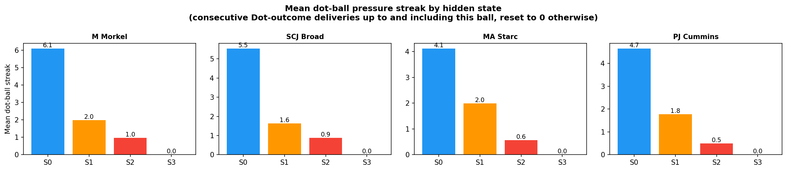

# Modelling Bowling "Strategy" with Hidden Markov Models

## The idea

The k-means analysis (`analysis.md`) found each bowler's repertoire of **delivery types** (clusters), based purely on the physical properties of the ball (speed, length, line, swing, seam, angles). That analysis treats every delivery independently — it has no notion of time or sequence. This document uses **exactly the same clusters** (the over/round-the-wicket split, e.g. Morkel's O0 "Short", R2 "Out-swinger", etc., with the same expert-given names) — so a cluster name means the same thing in both documents.

In reality, a bowler doesn't pick each ball at random. Across an over or a spell they tend to settle into a **plan** — e.g. "attack the stumps with the new ball" or "bowl tight and build pressure" — and that plan shapes which delivery types and outcomes show up in a run of consecutive balls. We can't observe the plan directly, but we can observe its consequences: which cluster each ball belongs to, what happened (dot ball / runs / wicket), and how much pressure had already been built up by the time the ball was bowled.

This is exactly the setup a **Hidden Markov Model (HMM)** is designed for ([background reading](https://luisdamiano.github.io/BayesHMM/articles/introduction.html)):

- A small number of **hidden states** represent the bowler's underlying "strategy" at each point in time.
- A **transition matrix** describes how likely the bowler is to stay in the same strategy from ball to ball, or switch to another.
- An **emission distribution** describes what we expect to observe (cluster, outcome, and pressure situation) given the current hidden strategy.

Given a sequence of observations, we can fit these three pieces and then run the **Viterbi algorithm** to decode the most likely hidden-strategy sequence underlying each bowler's deliveries.

### Bayesian vs. simple fitting

The BayesHMM article fits this model fully Bayesian (Stan, MCMC, priors on every parameter). That's the rigorous way to do it, but it's a lot of machinery for ~350-560 observations per bowler. In keeping with "nothing fancy", this analysis fits the **same model structure** (categorical HMM: discrete states, discrete observations) using the standard **Baum-Welch / EM algorithm** (`hmmlearn`'s `CategoricalHMM`), which gives maximum-likelihood estimates of the same π (initial probabilities), A (transition matrix) and θ (emission probabilities). The interpretation — filtering, smoothing, Viterbi decoding — is identical; we're just using point estimates instead of posterior distributions.

---

## Data preparation

For each of the four bowlers, every delivery is reduced to a single observed **symbol** combining three things:

**symbol = (ball cluster) × (outcome) × (pressure entering this ball)**

- **Ball cluster**: the per-bowler over/round-the-wicket-split cluster from `analysis.md` (4–6 clusters depending on bowler, e.g. O0/O1/.../R0/R1/...), capturing *what kind of ball it was*.
- **Outcome**: one of four categories capturing *what happened*:
  - **Dot** — no runs conceded, no wicket
  - **Runs** — runs conceded off the bat, no wicket
  - **Chance** — the bowler beat the bat, found an edge, or got the batter playing-and-missing/under appeal but didn't take the wicket this time: `Ball Events` contains "Edge", "Catch Chance", "Play and Miss" or "Appeal", with `Is Wicket` False
  - **Wicket** — the bowler took the wicket
- **Pressure entering this ball** (NEW, 2 categories) — see below.

### Adding "pressure" to the emission alphabet

Alongside outcome, we now also feed the model a simple proxy for **how much pressure the bowler had already built up by the time this ball was bowled**: the number of **consecutive dot balls bowled immediately before this one** (resetting to 0 at the start of each innings, and after any Runs/Chance/Wicket ball). This is computed as a **lagged** version of the dot-streak — i.e. it describes the situation the bowler walked into for *this* ball, not the outcome of this ball itself. We deliberately don't use the current-ball-inclusive streak here, because that would be almost mechanically tied to `Outcome` (a Dot ball always extends its own streak by definition), which would mostly just duplicate information the model already has.

This "pressure entering the ball" value is binned into two categories to keep the alphabet manageable:

- **Low pressure** — 0 or 1 dot balls immediately before this one
- **High pressure** — 2 or more dot balls immediately before this one

Combining this with the 4 outcome categories gives **8 "outcome × pressure" combinations** per ball cluster, so:

**symbol = cluster × 8 + (outcome × 2 + pressure bin)**

The alphabet size (`n_clusters × 8`) is therefore: **Morkel 48, Broad 40, Starc 48, Cummins 32** — roughly double the previous version's `n_clusters × 4` (16–24 symbols). Doubling the alphabet roughly doubles the number of emission parameters the model has to estimate for every hidden state, which is why — see "Choosing the number of hidden states" below — we now use **4 states instead of 5**.

### A separate descriptive measure: the dot-ball "pressure" streak

We also separately compute the **current-ball-inclusive** dot-streak (how many consecutive Dot-outcome deliveries have just been bowled, up to and including this one) — this is *not* part of the HMM's alphabet, it's used purely afterwards to describe what each decoded state "feels like" (see "Dot-ball pressure streaks by state" below). It's distinct from the lagged, binned `PressureStreak`/`StreakBin` used in the emission alphabet above: the descriptive version answers "how long has this state's run of dots gone on, including the ball itself", while the emission feature answers "what pressure situation did the bowler walk into for this ball".

Deliveries are ordered **chronologically** (match start date → innings → over → ball), so the HMM sees each bowler's deliveries in the order they were actually bowled, across all 51 matches in the dataset. The 7 tracking-error deliveries (<75 mph) excluded from the clustering are excluded here too.

### Strategies reset each innings

A bowler doesn't carry a "strategy" across a gap of weeks or months between Test matches — or even across the gap between bowling in the first innings of a match and coming back for the second. Whatever plan he had going into the last ball of one innings has no bearing on the first ball of the next. Originally this analysis concatenated all of a bowler's deliveries into one long sequence (or, in an earlier version, split only at match boundaries) and let the HMM model transitions across those gaps too, which implicitly assumes the strategy *can* carry over.

To fix this, each bowler's deliveries are still placed in one long chronological array (348–385 symbols), but `hmmlearn` is given a `lengths` array marking where each of the bowler's **innings** (not just matches) starts and ends — splitting on (Match ID, Innings ID) rather than just Match ID. A bowler can appear in both innings of the same Test, so this gives noticeably more (shorter) sequences per bowler than splitting by match alone: 15 innings for Morkel (vs 12 matches), 35 for Broad (vs 21), 28 for Starc (vs 17), and 24 for Cummins (vs 15). This means:

- The **transition matrix** `A` is only ever applied *within* an innings — there's no learned transition from the last ball of one innings to the first ball of the next.
- The **start probabilities** π are applied at the start of *every* innings, not just once at the start of the whole sequence — so π now has a real interpretation: "what state does this bowler tend to begin an innings in?"
- The **emission distributions** are still shared and fit across all innings (pooling data for statistical power), but decoding (Viterbi) is run innings-by-innings.

This is a standard way to handle multiple independent sequences with a single HMM, and it directly answers the question of whether a bowler's "starting strategy" is consistent innings-to-innings (persistent) or essentially reset/random.

---

## Choosing the number of hidden states

We fit the HMM separately for each bowler with **2, 3, 4, and 5 hidden states** (15 random restarts each, keeping the best-likelihood fit), and compare them with the **Bayesian Information Criterion (BIC)**, which penalises extra parameters — useful here because more states quickly add a lot of emission parameters relative to the amount of data, and with the larger 8-category-per-cluster alphabet this is even more true than before.

| | 2 states | 3 states | 4 states | 5 states |
|---|---|---|---|---|
| M Morkel | 2437.2 | 2623.6 | 2847.0 | 3116.2 |
| SCJ Broad | 2490.3 | 2626.9 | 2777.6 | 2965.1 |
| MA Starc | 2772.1 | 2943.6 | 3150.3 | 3423.2 |
| PJ Cummins | 2153.9 | 2227.5 | 2345.0 | 2434.8 |

For **all four bowlers, BIC is minimised at 2 states** and rises steadily through 3, 4 and 5. As before, the 2-state model is mostly just the over/round-the-wicket split, which doesn't tell us much about *strategy* beyond "which side of the stumps".

**The results below use 4 hidden states per bowler** (down from 5 in the previous version of this analysis). Two things changed this round: we added the "pressure entering the ball" dimension to the alphabet (roughly doubling its size, from `n_clusters × 4` to `n_clusters × 8`), and in exchange we dropped from 5 states to 4. With the bigger alphabet, 5 states would add a lot more emission parameters than the ~350–560 observations per bowler can comfortably support; 4 states keeps the parameter count more reasonable while still leaving room for the new pressure dimension to express itself differently across states — which, as it turns out, it does very clearly (see below). As with the 5-state version, this is a **deliberate trade of statistical parsimony for exploratory detail** — treat the smaller, more transient states (short expected dwell times) as suggestive rather than definitively estimated.

States are relabelled (after fitting) in order of "aggression" (wicket rate ×10 + chance rate ×5 + runs rate) — `State 0` is the most defensive, `State 3` the most aggressive — purely so states can be compared consistently across the figures. Chances are weighted at half a wicket: a near-miss is more "aggressive" than a plain run conceded, but less than an actual wicket. This relabelling means `State 0`...`State 3` here are not the "same" states as in earlier (5-state) versions of this analysis — the model has been refit from scratch with a different alphabet and a different number of states.

---

## Results

The timeline plot shows the Viterbi-decoded state for every delivery in chronological order (★ = wicket); the thin grey dotted lines mark **innings boundaries** — the HMM resets to its start distribution at each one, and no transition is modelled across them (whether between the two innings of the same match or across different matches).

The emission plot now has **three rows** per bowler, all showing the model's *fitted* probabilities for each state:

1. **P(ball cluster | state)** — what kind of delivery tends to be bowled in this state. Cluster codes (O0, O1, R0, ...) are the same ones used in `analysis.md` — see each bowler's table below for what they mean.
2. **P(outcome | state)** — Dot / Runs / Chance / Wicket.
3. **P(pressure entering ball | state)** *(new)* — "Low pressure (0-1 prior dots)" vs "High pressure (2+ prior dots)", i.e. what situation the bowler had walked into by the time a ball in this state was bowled.

The histogram below shows the same idea from the *decoded* side: for each bowler, it takes every delivery the Viterbi path actually assigned to a given state, and plots what share of those deliveries were each cluster. The last figure shows, for each state, the **mean dot-ball "pressure" streak** (the descriptive, current-ball-inclusive version — see "A separate descriptive measure" above) of the deliveries decoded into it.

A striking pattern emerges **consistently across all four bowlers**, despite their very different bowling styles:

- **State 0 — "sustaining pressure"**: always entered under high pressure (2+ prior dots), and almost always a Dot itself (95-100%). This is the bowler "keeping the screws on" after he's already built up a run of dots.
- **State 3 — "pressure release"**: 0% Dot for every bowler — by definition something happens (Runs, Chance or Wicket) — and almost always entered under high pressure (90-100%). This is where a build-up of dots ends, for better or worse.
- **State 2 — "open play"**: the largest state for every bowler (36-53% of deliveries), almost always entered under low pressure (99-100%), with a mixed bag of outcomes. This is the bowler's default working state, and (for three of the four bowlers) the state every innings starts in.
- **State 1**: the one state whose role differs by bowler — for Morkel and Broad it's a separate, persistent over-the-wicket containment mode; for Starc and Cummins it's a tight, low-pressure-entry "probe" state that sits between State 2 and State 0.

### M Morkel

| | State 0 (27.3%, ~4.1 balls) | State 1 (27.6%, ~9.1 balls) | State 2 (36.2%, ~3.3 balls) | State 3 (8.9%, ~1.0 ball) |
|---|---|---|---|---|
| Dominant clusters | R0 In-swinger (25%), R1 Full outside off (31%), R2 Out-swinger (39%), R3 Bouncer (5%) | O0 Short (27%), O1 Good length (73%) | R0 In-swinger (33%), R1 Full outside off (20%), R2 Out-swinger (40%), R3 Bouncer (7%) | R0 In-swinger (29%), R1 Full outside off (26%), R2 Out-swinger (35%), R3 Bouncer (10%) |
| Outcome | Dot 100%, Runs 0%, Chance 0%, Wicket 0% | Dot 71%, Runs 25%, Chance 2% (+2), **Wicket 2%** (+2) | Dot 70%, Runs 24%, Chance 4% (+5), **Wicket 2%** (+3) | Dot 0%, Runs 84%, **Chance 16%** (+5), Wicket 0% |
| Pressure entering ball | Low 0%, **High 100%** | Low 48%, High 52% | **Low 100%**, High 0% | Low 0%, **High 100%** |
| Mean dot-streak (descriptive) | 6.1 | 2.0 | 1.0 | 0.0 |
| Starts an innings in this state | 0 / 15 | 6 / 15 | 9 / 15 | 0 / 15 |

For Morkel, the over/round-the-wicket split lines up almost perfectly with the new "pressure" axis: **State 1 is his entire over-the-wicket repertoire** (27.6% of deliveries, 100% O0/O1, very sticky — dwell ~9.1 balls, 6/15 innings starting state), a tight-but-not-pristine mode (Dot 71%, with 2 wickets and 2 chances) where pressure entering the ball is roughly a coin flip. **All of his round-the-wicket deliveries are split across States 0, 2 and 3**, which form a clear cycle:

- **State 2 (36.2%, his largest state, dwell 3.3, 9/15 innings starting state)** is "open play" — always entered under low pressure, Dot 70% with most of his round-the-wicket chances (5) and wickets (3).
- From State 2 he sometimes transitions into **State 0 (27.3%, dwell 4.1)** — "sustaining pressure": always entered under high pressure (i.e. after he's already strung together 2+ dots), and itself **100% Dot** with the highest mean dot-streak of any state (6.1 balls) — the cleanest "lock-down" mode in the whole dataset.
- State 0 self-sustains 76% of the time, but 22% of the time it breaks into **State 3 (8.9%, transient, dwell 1.0)** — "pressure release": always entered under high pressure, and **0% Dot** — 84% Runs and a striking **16% Chance rate** (5 of his 12 recorded chances). State 3 then returns to State 2 93% of the time, completing the loop.

So for Morkel, the model has found a genuinely interpretable round-the-wicket "squeeze" cycle — open play → build a run of dots → either keep squeezing or have it broken (often via a chance) → back to open play — sitting alongside a separate, persistent over-the-wicket mode.

### SCJ Broad

| | State 0 (28.6%, ~4.2 balls) | State 1 (8.6%, ~26.4 balls) | State 2 (53.2%, ~3.9 balls) | State 3 (9.6%, ~1.0 ball) |
|---|---|---|---|---|
| Dominant clusters | R0 Back of length, nip-away (45%), R1 Full and straight (40%), R2 Good length, big swing away (15%) | O0 Short ball/bouncer (18%), O1 Good length, angle across (77%), R0 (3%), R1 (2%) | R0 Back of length, nip-away (39%), R1 Full and straight (39%), R2 Good length, big swing away (22%) | O1 (3%), R0 Back of length, nip-away (22%), R1 Full and straight (57%), R2 Good length, big swing away (19%) |
| Outcome | Dot 95%, Runs 0%, Chance 0%, **Wicket 5%** (+5) | Dot 65%, Runs 29%, Chance 6% (+2), Wicket 0% | Dot 64%, Runs 18%, **Chance 15%** (+30), **Wicket 3%** (+7) | Dot 0%, Runs 70%, **Chance 30%** (+11), Wicket 0% |
| Pressure entering ball | Low 0%, **High 100%** | Low 60%, High 40% | **Low 99%**, High 1% | Low 0%, **High 100%** |
| Mean dot-streak (descriptive) | 5.5 | 1.6 | 0.9 | 0.0 |
| Starts an innings in this state | 0 / 35 | 4 / 35 | 31 / 35 | 0 / 35 |

Broad's **State 2 dominates everything (53.2%, his largest state by far, dwell ~3.9, 31/35 innings starting state, 99% low-pressure entry)** — a genuinely "open play" mode covering all of his round-the-wicket repertoire and carrying the bulk of his chances (30 of 43, 70%) and wickets (7 of 12, 58%) simply because so much of his bowling happens here. **State 0 (28.6%, dwell 4.2)** is "sustaining pressure" — always entered under high pressure, also round-the-wicket, **95% Dot with the second-highest mean dot-streak (5.5)** — but unlike Morkel's equivalent state, it isn't perfectly clean: it carries **5 wickets**, the joint-highest wicket count of any of his states, suggesting that for Broad a long, tight squeeze can itself produce a breakthrough rather than just precede one. **State 3 (9.6%, transient, dwell 1.0)** is "pressure release" — always entered under high pressure, **0% Dot, his highest Chance rate by far (30%, 11 of 43)** but, notably, **zero wickets**: lots of near-misses that didn't quite convert. From State 3 he *always* returns to State 2 (transition probability 1.0). **State 1 (8.6%, dwell ~26.4 — by far the stickiest state for any bowler)** is a separate, near-pure over-the-wicket mode (95% O0/O1) that 4/35 innings start in and that, once entered, tends to persist for the whole innings (self-transition 0.962); pressure entering it is a near coin-flip (60/40).

### MA Starc

| | State 0 (26.6%, ~2.5 balls) | State 1 (18.0%, ~1.1 balls) | State 2 (40.5%, ~2.0 balls) | State 3 (14.9%, ~1.0 ball) |
|---|---|---|---|---|
| Dominant clusters | O0 (2%), O1 Length seam in (25%), O2 Length in-swinger (34%), O3 Full in-swinger (19%), O4 Bouncer (19%), R0 (1%) | O0 (5%), O1 (25%), O2 (36%), O3 (17%), O4 (14%), R0 (3%) | O0 (3%), O1 (32%), O2 (20%), O3 (24%), O4 (20%), R0 (2%) | O0 (2%), O1 (23%), O2 (33%), O3 (28%), O4 (11%), R0 (4%) |
| Outcome | Dot 96%, Runs 1%, Chance 0%, **Wicket 3%** (+3) | Dot 96%, Runs 0%, Chance 0%, **Wicket 4%** (+2) | Dot 54%, Runs 34%, Chance 8% (+12), **Wicket 3%** (+6) | Dot 0%, Runs 81%, **Chance 16%** (+9), **Wicket 4%** (+2) |
| Pressure entering ball | Low 0%, **High 100%** | **Low 95%**, High 5% | **Low 100%**, High 0% | Low 5%, **High 95%** |
| Mean dot-streak (descriptive) | 4.1 | 2.0 | 0.6 | 0.0 |
| Starts an innings in this state | 0 / 28 | 0 / 28 | 28 / 28 | 0 / 28 |

Starc bowls almost entirely **over the wicket** — the round-the-wicket cluster (R0) never makes up more than ~4% of any state — so unlike Morkel and Broad, **delivery type barely distinguishes Starc's states at all**: the cluster mix (length seam-in / in-swinger / full in-swinger / bouncer) is broadly similar across all four states. For Starc, the hidden states are almost entirely about the **outcome/pressure regime**, not what ball is bowled.

**Every single one of his 28 innings starts in State 2 (40.5%, his largest state, dwell 2.0, 100% low-pressure entry)** — "open play", a genuinely mixed state (Dot 54%, Runs 34%, Chance 8%, Wicket 3%) carrying the most chances (12) and wickets (6) of any state simply by volume. From here he transitions (49%) into **State 1 (18.0%, dwell 1.1, 95% low-pressure entry)** — a brief, very tight "probe" (96% Dot, 4% Wicket) that itself either reverts to State 0 (62%) or escalates straight to State 3 (26%). **State 0 (26.6%, dwell 2.5)** is "sustaining pressure" — always entered under high pressure, 96% Dot, second-highest mean streak (4.1) — and self-sustains 60% of the time before a 40% chance of breaking into **State 3 (14.9%, transient, dwell 1.0)** — "pressure release", entered under high pressure 95% of the time, **0% Dot**, and Starc's **highest combined threat of any state: 16% Chance + 4% Wicket = 20%** (9 chances + 2 wickets). State 3 always cycles back to State 2.

So Starc's states trace out a longer cycle than Morkel's or Broad's: **open play → probe → sustain pressure → release → back to open play** — four distinct phases of the same broad mix of deliveries, differentiated by what's happened recently and what happens next, rather than by delivery type. *Caveat*: as in `analysis.md`, O0 (Length, out-swinger) contains a handful of deliveries with an anomalous (physically implausible) positive Drop Angle — a Hawk-Eye tracking artefact, not a genuine delivery type — but with this 4-state model O0 is now spread thinly across all four states (1-5% each) rather than concentrated in one, so it shouldn't meaningfully distort any single state's profile.

### PJ Cummins

| | State 0 (27.4%, ~3.4 balls) | State 1 (16.3%, ~1.0 ball) | State 2 (42.4%, ~2.5 balls) | State 3 (13.9%, ~1.0 ball) |
|---|---|---|---|---|
| Dominant clusters | O0 Good swinger (47%), O1 Angle-in (46%), O2 Bouncer (6%), R0 (1%) | O0 (56%), O1 (41%), O2 (2%), R0 (2%) | O0 (45%), O1 (39%), O2 Bouncer (15%), R0 (0%) | O0 (29%), O1 (56%), O2 (13%), R0 (2%) |
| Outcome | Dot 98%, Runs 1%, Chance 0%, **Wicket 1%** (+1) | Dot 97%, Runs 2%, Chance 0%, **Wicket 2%** (+1) | Dot 49%, Runs 40%, **Chance 9%** (+13), **Wicket 2%** (+4) | Dot 0%, Runs 81%, **Chance 17%** (+10), **Wicket 2%** (+1) |
| Pressure entering ball | Low 2%, **High 98%** | **Low 100%**, High 0% | **Low 100%**, High 0% | Low 10%, **High 90%** |
| Mean dot-streak (descriptive) | 4.7 | 1.8 | 0.5 | 0.0 |
| Starts an innings in this state | 0 / 24 | 0 / 24 | 24 / 24 | 0 / 24 |

Like Starc, **Cummins' delivery mix barely changes across states** — good-swinger and angle-in deliveries dominate everywhere, with bouncers a bit more common in State 2 and angle-ins a bit more common in State 3 — so again it's the pressure/outcome regime, not the ball type, that defines these states.

**All 24 innings start in State 2 (42.4%, his largest state, dwell 2.5, 100% low-pressure entry)** — "open play", a genuinely mixed bag (Dot 49%, Runs 40%, Chance 9%, Wicket 2%) holding most of his chances (13 of 23) and the most wickets (4). From here, 39.5% of the time he moves into **State 1 (16.3%, dwell 1.0, 100% low-pressure entry)** — a brief, very tight probe (97% Dot, 2% Wicket). State 1 then either drops into **State 0 (27.4%, dwell 3.4)** — "sustaining pressure", always entered under high pressure, 98% Dot, the **highest mean dot-streak of any state for Cummins (4.7)** — or jumps straight to **State 3 (13.9%, transient, dwell 1.0)** — "pressure release", entered under high pressure 90% of the time, **0% Dot**, and Cummins' **highest combined threat (17% Chance + 2% Wicket = 19%)**, with 10 of his 23 chances. State 0 itself has a 29.3% chance of breaking straight into State 3 too. State 3 always returns to State 2.

Cummins' cycle therefore mirrors Starc's almost exactly in structure — **open play → probe → sustain → release → back to open play** — despite the two bowlers having very different repertoires (Cummins is a swing/seam attacker with no real round-the-wicket mode, Starc bowls a wider variety of lengths and angles). This consistency across two quite different fast bowlers, and the similar (if simpler) pattern in Morkel and Broad, is the headline finding of this 4-state model.

---

## Dot-ball pressure streaks by state

The dot-streak plot above shows the **mean "consecutive dots so far" streak** (the current-ball-inclusive, descriptive version — distinct from the lagged `PressureStreak`/`StreakBin` that's part of the emission alphabet) of the deliveries decoded into each state. It lines up neatly with the "pressure" story above:

- **State 0 ("sustaining pressure") has by far the highest mean streak for every bowler** — Morkel 6.1, Broad 5.5, Starc 4.1, Cummins 4.7 — exactly as its name suggests: by the time a ball is decoded into State 0, the bowler has typically already strung together several dots, and State 0 itself is overwhelmingly another dot.
- **State 3 ("pressure release") has a mean streak of exactly 0.0 for every bowler.** This is partly mechanical: State 3 is by definition 0% Dot, and the current-ball-inclusive streak resets to 0 the moment a ball isn't a dot — so *any* state with 0% Dot will automatically show a mean streak of 0. It's still a useful sanity check, though: it confirms that "pressure release" really does mean the streak visibly breaking, not just a change in the model's internal bookkeeping.
- **State 2 ("open play") has the lowest non-zero mean streak for every bowler** (Morkel 1.0, Broad 0.9, Starc 0.6, Cummins 0.5) — consistent with it being the state where pressure is rarely sustained for long, matching its near-universal "low pressure entering" emission probability.
- **State 1 sits in between** (Morkel 2.0, Broad 1.6, Starc 2.0, Cummins 1.8) for all four bowlers, regardless of whether it plays the role of a separate over-the-wicket mode (Morkel, Broad) or a probe state in the open-play→sustain cycle (Starc, Cummins).

In short, the descriptive (current-ball-inclusive) streak and the lagged, binned pressure feature baked into the emission alphabet tell a **consistent story from two different angles**, which is reassuring — the "pressure as strategy" pattern isn't an artefact of one particular way of measuring it.

---

## How does the strategy mix change innings-by-innings?

With each innings treated as its own sequence, this plot is a direct readout of the model's per-innings behaviour rather than an artefact of one long concatenated decode.

Each bar is one innings (in chronological order, left to right), showing what fraction of that bowler's deliveries in that innings were decoded as State 0 (blue, "sustaining pressure"), State 1 (orange), State 2 (red, "open play"), or State 3 (purple, "pressure release"). The number above each bar is how many deliveries that bowler bowled at this batter in that innings — many innings are single-figure samples, so individual bars should be read cautiously, but the overall pattern across many innings is informative.

- **M Morkel**: State 2 (red, "open play") and State 1 (orange, his persistent over-the-wicket mode) are the two largest blocks in most innings, with State 0 (blue, "sustaining pressure") and State 3 (purple, "release") appearing as smaller slices in many — reflecting the round-the-wicket open-play/sustain/release cycle running alongside the separate over-the-wicket mode within almost every innings.
- **SCJ Broad**: State 2 (red, "open play") is the dominant colour in nearly every innings, often the majority of the bar — consistent with it being 53.2% of all his deliveries and the starting state for 31/35 innings. A handful of innings are decoded as **almost entirely State 1 (orange)** — his extremely sticky, separate over-the-wicket mode (dwell ~26 balls) — and most innings carry visible slivers of State 0 (blue, "sustain") and State 3 (purple, "release").
- **MA Starc**: most innings show a mix dominated by **State 2 (red, "open play") and State 0 (blue, "sustaining pressure")**, with State 1 (orange, "probe") and State 3 (purple, "release") present as smaller blocks in almost every innings — consistent with his longer open-play→probe→sustain→release cycle running repeatedly within a single innings rather than the bowler settling into one mode for the whole spell.
- **PJ Cummins**: similar to Starc — **State 2 (red, "open play") and State 0 (blue, "sustaining pressure")** are usually the largest components of each innings' bar, with State 1 (orange, "probe") and State 3 (purple, "release") recurring as smaller blocks throughout, again pointing to the cycle repeating multiple times per innings rather than a single dominant mode.

---

## Home vs away

The dataset records whether the bowling team was playing at home, away, or (rarely) on neutral ground. This field is blank for all the England-vs-Australia (Ashes) matches, so for those we derive it from `Ground Country`: a ground in England or Wales counts as "home" for England and "away" for Australia, and vice versa for grounds in Australia.

The top row shows the State 0–3 split for home vs away deliveries; the bottom row shows the overall wicket rate for home vs away (not split by state, since the per-state-per-venue samples get very small). Wicket rates here are unaffected by anything in this round's changes (Chance and Wicket remain separate categories, and the wicket rate is computed straight from `Is Wicket`).

- **Wicket rate is higher at home for three of the four bowlers** (Morkel 2.3% vs 1.3%, Broad 3.3% vs 2.5%, Starc 4.0% vs 2.7%; Cummins is the exception at 1.4% home vs 2.1% away) — matching the general expectation that home conditions and crowd support tend to favour the bowling side.
- **Morkel's home sample (n=43, essentially one innings) is similar to away in States 0/2 (28%/27% and 44%/35%)**, but leans more on State 1 (his over-the-wicket mode) away (30% vs 9% home) and on State 3 ("release") at home (19% vs 8% away) — with only n=43 at home this should be read cautiously, but it's at least consistent with the higher home wicket rate (more time in "release", which is where his chances and the only round-the-wicket variation in outcome live).
- **Broad's State 2 ("open play") is somewhat smaller at home than away (56% vs 43%)**, with State 0 ("sustain") correspondingly smaller at home (27% vs 34%) and States 1/3 each a touch larger at home (8%/9% vs 11%/11% — actually both larger away). The differences are modest, and the home wicket rate being higher (3.3% vs 2.5%) doesn't map onto an obvious single-state shift — more time in "open play" away didn't translate into more away wickets, again pointing to within-state, match-to-match variation rather than a clean state-mix story.
- **Starc's home/away split is fairly close on State 2 (38% home vs 43% away)**, but home carries more State 0 ("sustain", 31% vs 22% away) while away carries slightly more State 3 ("release", 16% vs 13% home) and the same State 1 share (18% both). Despite away spending a bit more time in his highest-threat state (State 3), the home wicket rate is still higher (4.0% vs 2.7%) — again suggesting the home/away wicket-rate gap is more about overall conditions than which of these four states he's in.
- **Cummins shows the sharpest split**: State 0 ("sustain") is more than twice as common at home (42% vs 18% away), while State 2 ("open play") is much more common away (50% vs 30% home), and States 1/3 are broadly similar (15%/13% home vs 17%/15% away). Despite home leaning heavily on his tightest state, the *away* wicket rate is higher (2.1% vs 1.4%) — consistent with away innings spending much more time in "open play" (State 2), which holds the bulk of his chances and wickets simply by volume.

---

## Caveats

- **4 states is a deliberate choice, not the BIC-optimal one.** BIC prefers 2 states for every bowler, by a wide margin (e.g. Morkel: 2437.2 at 2 states vs 3116.2 at 5). The 2-state model is the statistically "safer" choice, but it mostly just recovers the over/round-the-wicket split. 4 states was chosen here — down from 5 in the previous version — specifically to make room for the new "pressure entering the ball" emission dimension without pushing the parameter count too far past what 350–560 observations per bowler can support. The resulting "open play / probe / sustain / release" pattern is genuinely consistent across all four bowlers, but should still be treated as **hypothesis-generating, not confirmed** — especially the transient states with ~1-ball expected dwell times.
- **Sample size**: 350–560 balls per bowler, split across 15–35 innings, is small for HMM fitting — many innings contribute only a handful of observations to the per-innings decoding, and with an alphabet of 32–48 symbols per bowler this is a real constraint.
- **The "strategies reset each innings" assumption is itself a modelling choice**, not a certainty — international bowlers do carry plans and form across a match or series (e.g. "this batter struggled against X last time, do it again"). Treating innings as fully independent is a reasonable simplification, but innings-to-innings continuity is not literally zero.
- **The states are descriptive, not causal.** The HMM finds statistical regimes in the sequence; it doesn't know *why* the regime changed (new ball, declaration tactics, a different batter on strike, fatigue, etc.).
- **Label switching**: hidden states from EM have no inherent ordering. States were sorted by an "aggression score" (wicket rate ×10 + chance rate ×5 + runs rate) purely so State 0...State 3 mean roughly the same thing (low to high aggression) across bowlers, but the absolute values are not directly comparable across bowlers (each HMM was fit independently).
- **Shared clustering with `analysis.md`**: the ball clusters feeding the HMM are identical to the over/round-the-wicket-split clusters described and named in `analysis.md`, so cluster names (O0, R1, ...) mean the same thing in both documents.
- **Chances**: deliveries where `Ball Events` records "Edge", "Catch Chance", "Play and Miss" or "Appeal", but no wicket, are their own outcome category alongside Dot/Runs/Wicket (12–43 per bowler, 3.4%–11.2% of deliveries). The per-state "+N chance"/"+N wicket" counts in each table are the raw decoded counts the percentages are derived from.
- **The "pressure entering the ball" feature is a lagged, history-dependent quantity**, computed from each innings' running dot-streak *before* the current ball, then binned to "low" (0-1 prior dots) vs "high" (2+ prior dots) and folded into the emission alphabet alongside cluster and outcome. It is deliberately *not* the same as the descriptive (current-ball-inclusive) dot-streak used for the "Mean dot-streak" rows and `hmm_dot_streaks.png` — see "A separate descriptive measure" above for why the two are kept distinct, and "Dot-ball pressure streaks by state" for how they nonetheless tell a consistent story.
- **Starc's O0 (Length, out-swinger)** contains a small number of deliveries with an anomalous (physically implausible) positive Drop Angle — a Hawk-Eye tracking artefact flagged in `analysis.md`, not a genuine delivery type. In this 4-state model O0 makes up only 1-5% of any given state (vs being concentrated in one small state in the previous 5-state version), so it's unlikely to be materially distorting any single state's profile, but it's worth bearing in mind when reading Starc's cluster mixes.
