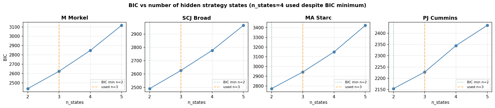
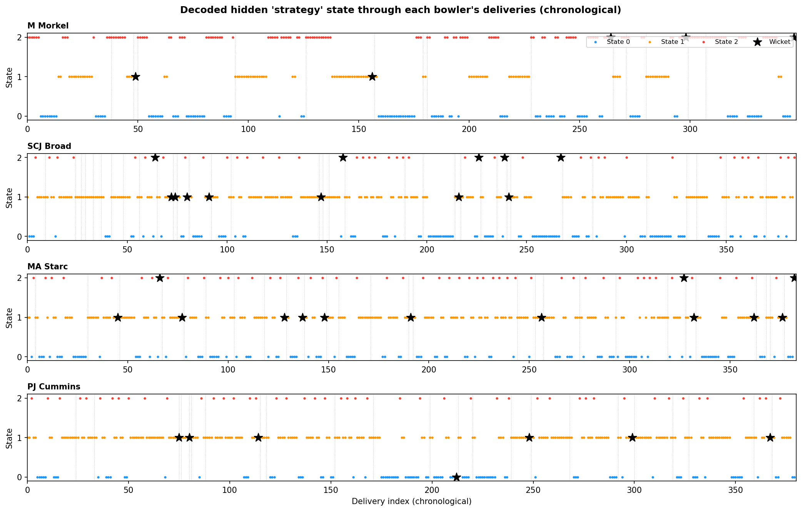
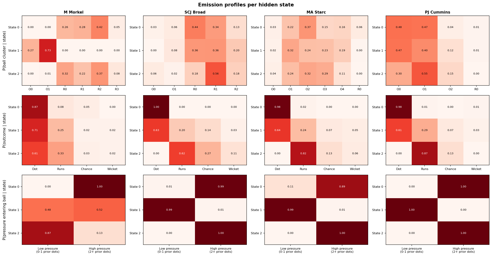
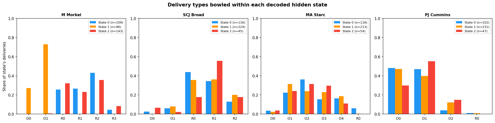
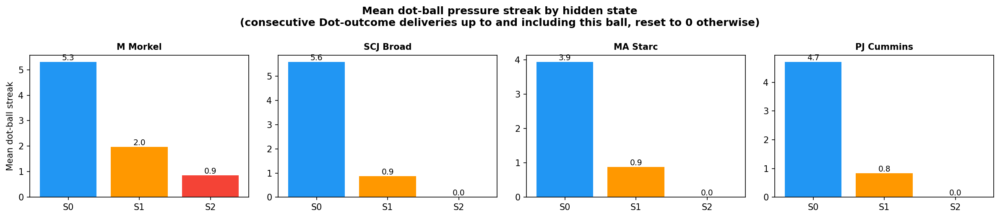
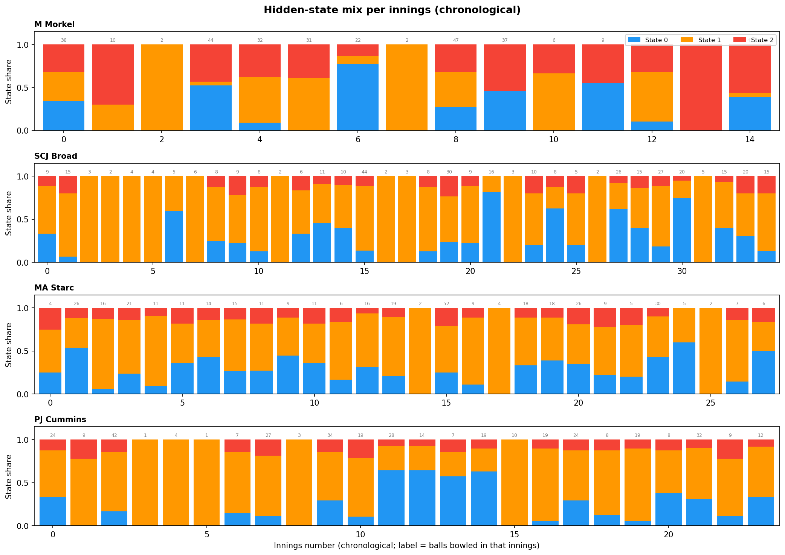
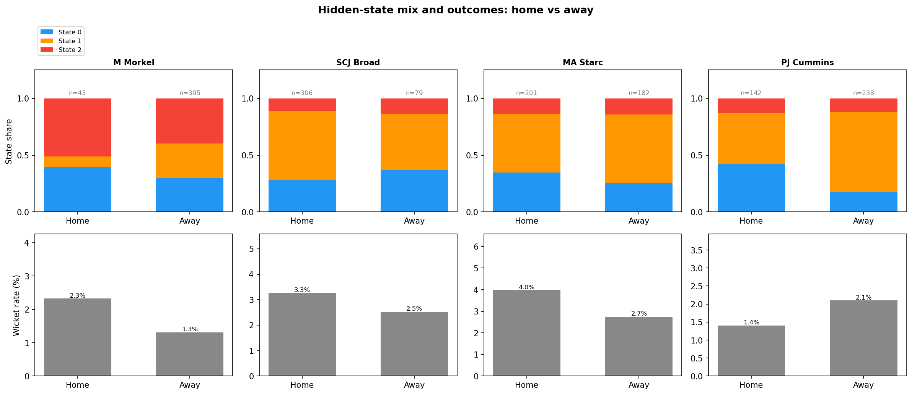

# Modelling Bowling "Strategy" with Hidden Markov Models

## The idea

The k-means analysis (`../kmeans_analysis/analysis.md`) found each bowler's repertoire of **delivery types** (clusters), based purely on the physical properties of the ball (speed, length, line, swing, seam, angles). That analysis treats every delivery independently — it has no notion of time or sequence. This document uses **exactly the same clusters** (the over/round-the-wicket split, e.g. Morkel's O0 "Short", R2 "Out-swinger", etc., with the same expert-given names) — so a cluster name means the same thing in both documents.

In reality, a bowler doesn't pick each ball at random. Across an over or a spell they tend to settle into a **plan** — e.g. "attack the stumps with the new ball" or "bowl tight and build pressure" — and that plan shapes which delivery types and outcomes show up in a run of consecutive balls. We can't observe the plan directly, but we can observe its consequences: which cluster each ball belongs to, what happened (dot ball / runs / wicket), and how much pressure had already been built up by the time the ball was bowled.

This is exactly the setup a **Hidden Markov Model (HMM)** is designed for ([background reading](https://luisdamiano.github.io/BayesHMM/articles/introduction.html)):

- A small number of **hidden states** represent the bowler's underlying "strategy" at each point in time.
- A **transition matrix** describes how likely the bowler is to stay in the same strategy from ball to ball, or switch to another.
- An **emission distribution** describes what we expect to observe (cluster, outcome, and pressure situation) given the current hidden strategy.

Given a sequence of observations, we can fit these three pieces and then run the **Viterbi algorithm** to decode the most likely hidden-strategy sequence underlying each bowler's deliveries.

### Bayesian vs. simple fitting

The BayesHMM article fits this model fully Bayesian (Stan, MCMC, priors on every parameter). That's the rigorous way to do it, but it's a lot of machinery for ~350-560 observations per bowler. In keeping with "nothing fancy", this analysis fits the **same model structure** (categorical HMM: discrete states, discrete observations) using the standard **Baum-Welch / EM algorithm** (`hmmlearn`'s `CategoricalHMM`), which gives maximum-likelihood estimates of the same π (initial probabilities), A (transition matrix) and θ (emission probabilities). The interpretation — filtering, smoothing, Viterbi decoding — is identical; we're just using point estimates instead of posterior distributions.

---

## Data preparation

For each of the four bowlers, every delivery is reduced to a single observed **symbol** combining three things:

**symbol = (ball cluster) × (outcome) × (pressure entering this ball)**

- **Ball cluster**: the per-bowler over/round-the-wicket-split cluster from `../kmeans_analysis/analysis.md` (4–6 clusters depending on bowler, e.g. O0/O1/.../R0/R1/...), capturing *what kind of ball it was*.
- **Outcome**: one of four categories capturing *what happened*:
  - **Dot** — no runs conceded, no wicket
  - **Runs** — runs conceded off the bat, no wicket
  - **Chance** — the bowler beat the bat, found an edge, or got the batter playing-and-missing/under appeal but didn't take the wicket this time: `Ball Events` contains "Edge", "Catch Chance", "Play and Miss" or "Appeal", with `Is Wicket` False
  - **Wicket** — the bowler took the wicket
- **Pressure entering this ball** (NEW, 2 categories) — see below.

### Adding "pressure" to the emission alphabet

Alongside outcome, we now also feed the model a simple proxy for **how much pressure the bowler had already built up by the time this ball was bowled**: the number of **consecutive dot balls bowled immediately before this one** (resetting to 0 at the start of each innings, and after any Runs/Chance/Wicket ball). This is computed as a **lagged** version of the dot-streak — i.e. it describes the situation the bowler walked into for *this* ball, not the outcome of this ball itself. We deliberately don't use the current-ball-inclusive streak here, because that would be almost mechanically tied to `Outcome` (a Dot ball always extends its own streak by definition), which would mostly just duplicate information the model already has.

This "pressure entering the ball" value is binned into two categories to keep the alphabet manageable:

- **Low pressure** — 0 or 1 dot balls immediately before this one
- **High pressure** — 2 or more dot balls immediately before this one

Combining this with the 4 outcome categories gives **8 "outcome × pressure" combinations** per ball cluster, so:

**symbol = cluster × 8 + (outcome × 2 + pressure bin)**

The alphabet size (`n_clusters × 8`) is therefore: **Morkel 48, Broad 40, Starc 48, Cummins 32** — roughly double the previous version's `n_clusters × 4` (16–24 symbols). Doubling the alphabet roughly doubles the number of emission parameters the model has to estimate for every hidden state, which is why — see "Choosing the number of hidden states" below — we use **3 states**.

### A separate descriptive measure: the dot-ball "pressure" streak

We also separately compute the **current-ball-inclusive** dot-streak (how many consecutive Dot-outcome deliveries have just been bowled, up to and including this one) — this is *not* part of the HMM's alphabet, it's used purely afterwards to describe what each decoded state "feels like" (see "Dot-ball pressure streaks by state" below). It's distinct from the lagged, binned `PressureStreak`/`StreakBin` used in the emission alphabet above: the descriptive version answers "how long has this state's run of dots gone on, including the ball itself", while the emission feature answers "what pressure situation did the bowler walk into for this ball".

Deliveries are ordered **chronologically** (match start date → innings → over → ball), so the HMM sees each bowler's deliveries in the order they were actually bowled, across all 51 matches in the dataset. The 7 tracking-error deliveries (<75 mph) excluded from the clustering are excluded here too.

### Strategies reset each innings

A bowler doesn't carry a "strategy" across a gap of weeks or months between Test matches — or even across the gap between bowling in the first innings of a match and coming back for the second. Whatever plan he had going into the last ball of one innings has no bearing on the first ball of the next. Originally this analysis concatenated all of a bowler's deliveries into one long sequence (or, in an earlier version, split only at match boundaries) and let the HMM model transitions across those gaps too, which implicitly assumes the strategy *can* carry over.

To fix this, each bowler's deliveries are still placed in one long chronological array (348–385 symbols), but `hmmlearn` is given a `lengths` array marking where each of the bowler's **innings** (not just matches) starts and ends — splitting on (Match ID, Innings ID) rather than just Match ID. A bowler can appear in both innings of the same Test, so this gives noticeably more (shorter) sequences per bowler than splitting by match alone: 15 innings for Morkel (vs 12 matches), 35 for Broad (vs 21), 28 for Starc (vs 17), and 24 for Cummins (vs 15). This means:

- The **transition matrix** `A` is only ever applied *within* an innings — there's no learned transition from the last ball of one innings to the first ball of the next.
- The **start probabilities** π are applied at the start of *every* innings, not just once at the start of the whole sequence — so π now has a real interpretation: "what state does this bowler tend to begin an innings in?"
- The **emission distributions** are still shared and fit across all innings (pooling data for statistical power), but decoding (Viterbi) is run innings-by-innings.

This is a standard way to handle multiple independent sequences with a single HMM, and it directly answers the question of whether a bowler's "starting strategy" is consistent innings-to-innings (persistent) or essentially reset/random.

---

## Choosing the number of hidden states

We fit the HMM separately for each bowler with **2, 3, 4, and 5 hidden states** (15 random restarts each, keeping the best-likelihood fit), and compare them with the **Bayesian Information Criterion (BIC)**, which penalises extra parameters — useful here because more states quickly add a lot of emission parameters relative to the amount of data, and with the larger 8-category-per-cluster alphabet this is even more true than before.

| | 2 states | 3 states | 4 states | 5 states |
|---|---|---|---|---|
| M Morkel | 2437.2 | 2623.6 | 2847.0 | 3116.2 |
| SCJ Broad | 2490.3 | 2626.9 | 2777.6 | 2965.1 |
| MA Starc | 2772.1 | 2943.6 | 3150.3 | 3423.2 |
| PJ Cummins | 2153.9 | 2227.5 | 2345.0 | 2434.8 |

For **all four bowlers, BIC is minimised at 2 states** and rises steadily through 3, 4 and 5. As before, the 2-state model is mostly just the over/round-the-wicket split, which doesn't tell us much about *strategy* beyond "which side of the stumps".

**The results below use 3 hidden states per bowler** (down from 4 in the previous version of this analysis). Two reasons for going simpler: first, the user asked for something "quite simple and interpretable" — and as it turns out, **3 states is exactly enough to recover a clean, universal "open play → sustaining pressure → pressure release → back to open play" cycle for every bowler** (see below), without needing a fourth, more marginal state to make sense of it. Second, with the bigger 8-category-per-cluster alphabet, 3 states keeps the parameter count comfortably within what 350–560 observations per bowler can support, so the smaller states (still ~12-15% of deliveries, ~1-ball expected dwell) are estimated on a reasonable amount of data. As before, this is a **deliberate trade of statistical parsimony for exploratory detail** relative to the BIC-optimal 2 states — but going from 4 down to 3 actually loses very little of the story while making it considerably easier to follow.

States are relabelled (after fitting) in order of "aggression" (wicket rate ×10 + chance rate ×5 + runs rate) — `State 0` is the most defensive, `State 2` the most aggressive — purely so states can be compared consistently across the figures. Chances are weighted at half a wicket: a near-miss is more "aggressive" than a plain run conceded, but less than an actual wicket. This relabelling means `State 0`...`State 2` here are not the "same" states as in earlier (4- or 5-state) versions of this analysis — the model has been refit from scratch with a different number of states.

---

## Results

The timeline plot shows the Viterbi-decoded state for every delivery in chronological order (★ = wicket); the thin grey dotted lines mark **innings boundaries** — the HMM resets to its start distribution at each one, and no transition is modelled across them (whether between the two innings of the same match or across different matches).

The emission plot now has **three rows** per bowler, all showing the model's *fitted* probabilities for each state:

1. **P(ball cluster | state)** — what kind of delivery tends to be bowled in this state. Cluster codes (O0, O1, R0, ...) are the same ones used in `../kmeans_analysis/analysis.md` — see each bowler's table below for what they mean.
2. **P(outcome | state)** — Dot / Runs / Chance / Wicket.
3. **P(pressure entering ball | state)** *(new)* — "Low pressure (0-1 prior dots)" vs "High pressure (2+ prior dots)", i.e. what situation the bowler had walked into by the time a ball in this state was bowled.

The histogram below shows the same idea from the *decoded* side: for each bowler, it takes every delivery the Viterbi path actually assigned to a given state, and plots what share of those deliveries were each cluster. The last figure shows, for each state, the **mean dot-ball "pressure" streak** (the descriptive, current-ball-inclusive version — see "A separate descriptive measure" above) of the deliveries decoded into it.

A striking pattern emerges **consistently across all four bowlers**, despite their very different bowling styles — a simple three-state cycle:

- **State 0 — "sustaining pressure"**: almost always entered under high pressure (2+ prior dots, 89-100%), and itself overwhelmingly a Dot (87-100%). This is the bowler "keeping the screws on" after he's already built up a run of dots.
- **State 1 — "open play"**: the largest state for every bowler (28-61% of deliveries), almost always entered under low pressure (87-100%), with a mixed bag of outcomes (Dot 61-71%, plus runs, chances and most wickets). This is the bowler's default working state, and the state nearly every innings starts in.
- **State 2 — "pressure release"**: 0% Dot for every bowler — by definition something happens (Runs, Chance or Wicket) — and entered under high pressure for three of the four bowlers (Morkel is the partial exception — see below). This is where a build-up of dots ends, for better or worse, and it's the smallest, most transient state (12-15% of deliveries, ~1-ball expected dwell) for every bowler.

The transition matrices tell the same story for Broad, Starc and Cummins: **State 2 ("release") always leads back to State 1 ("open play") with probability 1.0**, State 1 mostly self-sustains but sometimes drifts into State 0 ("sustain"), and State 0 either self-sustains or breaks into State 2. So the cycle is `open play → sustain → release → open play`, with open play occasionally jumping straight to release. Morkel's version of this cycle is broken up by his over/round-the-wicket split — see his table below.

### M Morkel

| | State 0 (31.3%, ~5.0 balls) | State 1 (27.6%, ~9.1 balls) | State 2 (41.1%, ~5.0 balls) |
|---|---|---|---|
| Dominant clusters | R0 In-swinger (26%), R1 Full outside off (28%), R2 Out-swinger (42%), R3 Bouncer (5%) | O0 Short (27%), O1 Good length (73%) | R0 In-swinger (32%), R1 Full outside off (22%), R2 Out-swinger (37%), R3 Bouncer (8%) |
| Outcome | Dot 87%, Runs 8%, Chance 5% (+5), Wicket 0% | Dot 71%, Runs 25%, Chance 2% (+2), **Wicket 2%** (+2) | Dot 61%, Runs 33%, Chance 3% (+5), **Wicket 2%** (+3) |
| Pressure entering ball | Low 0%, **High 100%** | Low 48%, High 52% | **Low 87%**, High 13% |
| Mean dot-streak (descriptive) | 5.3 | 2.0 | 0.9 |
| Starts an innings in this state | 0 / 15 | 6 / 15 | 9 / 15 |

For Morkel, the over/round-the-wicket split still dominates the picture: **State 1 is his entire over-the-wicket repertoire** (27.6% of deliveries, 100% O0/O1, very sticky — dwell ~9.1 balls, 6/15 innings starting state), a tight-but-not-pristine mode (Dot 71%, with 2 wickets and 2 chances) where pressure entering the ball is roughly a coin flip. **All of his round-the-wicket deliveries are split across States 0 and 2**, which cycle into each other:

- **State 2 (41.1%, his largest state, dwell 5.0, 9/15 innings starting state)** is his "open play" — almost always entered under low pressure (87%), Dot 61% with a mix of runs, his round-the-wicket chances (5) and most of his round-the-wicket wickets (3).
- From State 2 he sometimes transitions into **State 0 (31.3%, dwell 5.0)** — "sustaining pressure": always entered under high pressure (i.e. after he's already strung together 2+ dots), and itself 87% Dot with the highest mean dot-streak of any state (5.3 balls).
- State 0 self-sustains 80% of the time, and 17% of the time returns to State 2.

Unlike the other three bowlers, Morkel doesn't have a separate "pressure release" state with 0% Dot — at 3 states, the round-the-wicket "release" deliveries (a handful of big-hit/chance balls) are absorbed back into State 2 rather than splitting out on their own. So for Morkel the model finds a two-state round-the-wicket "open play ⇄ sustain pressure" cycle, sitting alongside his separate, persistent over-the-wicket mode.

### SCJ Broad

| | State 0 (30.1%, ~3.4 balls) | State 1 (58.2%, ~4.0 balls) | State 2 (11.7%, ~1.0 ball) |
|---|---|---|---|
| Dominant clusters | O0 Short ball/bouncer (3%), O1 Good length, angle across (6%), R0 Back of length, nip-away (44%), R1 Full and straight (34%), R2 Good length, big swing away (13%) | O1 (8%), R0 (36%), R1 (36%), R2 (20%) | O0 (6%), O1 (2%), R0 (18%), R1 (56%), R2 (18%) |
| Outcome | Dot 100%, Runs 0%, Chance 0%, Wicket 0% | Dot 63%, Runs 20%, **Chance 14%** (+31), **Wicket 3%** (+7) | Dot 0%, Runs 62%, **Chance 27%** (+12), **Wicket 11%** (+5) |
| Pressure entering ball | Low 1%, **High 99%** | **Low 99%**, High 1% | Low 0%, **High 100%** |
| Mean dot-streak (descriptive) | 5.6 | 0.9 | 0.0 |
| Starts an innings in this state | 0 / 35 | 35 / 35 | 0 / 35 |

Broad's **State 1 dominates everything (58.2%, his largest state by far, dwell ~4.0, all 35/35 innings starting state, 99% low-pressure entry)** — "open play", a genuinely mixed bag (Dot 63%, Runs 20%, Chance 14%, Wicket 3%) covering his whole repertoire and carrying most of his chances (31 of 43, 72%) and wickets (7 of 12, 58%) simply because so much of his bowling happens here. **State 0 (30.1%, dwell 3.4)** is "sustaining pressure" — almost always entered under high pressure (99%), entirely round-the-wicket, **100% Dot with the highest mean dot-streak (5.6)** — the cleanest "lock-down" mode in the dataset, with zero wickets or chances. **State 2 (11.7%, transient, dwell 1.0)** is "pressure release" — always entered under high pressure, **0% Dot**, and by far his highest combined threat: **27% Chance + 11% Wicket = 38%** (12 chances, 5 wickets — the joint-highest wicket count of any of his states). From State 2 he *always* returns to State 1 (transition probability 1.0), and from State 1 he occasionally drifts into State 0 (18.5%) or, more rarely, straight into State 2 (6.2%) — while State 0 itself has a 29.1% chance of breaking straight into State 2.

### MA Starc

| | State 0 (30.3%, ~2.6 balls) | State 1 (55.6%, ~3.4 balls) | State 2 (14.1%, ~1.0 ball) |
|---|---|---|---|
| Dominant clusters | O0 (3%), O1 Length seam in (22%), O2 Length in-swinger (37%), O3 Full in-swinger (15%), O4 Bouncer (16%), R0 (6%) | O0 (2%), O1 (32%), O2 (24%), O3 (23%), O4 (19%), R0 (0%) | O0 (4%), O1 (24%), O2 (32%), O3 (29%), O4 (11%), R0 (0%) |
| Outcome | Dot 98%, Runs 2%, Chance 0%, Wicket 0% | Dot 64%, Runs 24%, Chance 7% (+14), **Wicket 5%** (+10) | Dot 0%, Runs 82%, **Chance 13%** (+7), **Wicket 6%** (+3) |
| Pressure entering ball | Low 11%, **High 89%** | **Low 99%**, High 1% | Low 0%, **High 100%** |
| Mean dot-streak (descriptive) | 3.9 | 0.9 | 0.0 |
| Starts an innings in this state | 0 / 28 | 28 / 28 | 0 / 28 |

Starc bowls almost entirely **over the wicket** — the round-the-wicket cluster (R0) never makes up more than ~6% of any state — so unlike Morkel and Broad, **delivery type barely distinguishes Starc's states at all**: the cluster mix (length seam-in / in-swinger / full in-swinger / bouncer) is broadly similar across all three states. For Starc, the hidden states are almost entirely about the **outcome/pressure regime**, not what ball is bowled.

**Every single one of his 28 innings starts in State 1 (55.6%, his largest state, dwell 3.4, 99% low-pressure entry)** — "open play", a genuinely mixed state (Dot 64%, Runs 24%, Chance 7%, Wicket 5%) carrying most of his chances (14 of 21, 67%) and the bulk of his wickets (10 of 13, 77%) simply by volume. **State 0 (30.3%, dwell 2.6)** is "sustaining pressure" — almost always entered under high pressure (89%), 98% Dot, second-highest mean streak (3.9), and entirely wicket/chance-free. **State 2 (14.1%, transient, dwell 1.0)** is "pressure release" — always entered under high pressure, **0% Dot**, and Starc's **highest combined threat per ball: 13% Chance + 6% Wicket = 19%** (7 chances + 3 wickets). From State 2 he *always* returns to State 1 (transition probability 1.0); from State 1 he sometimes drifts into State 0 (23.9%) or, more rarely, straight into State 2 (5.4%); and State 0 itself has a 38.1% chance of breaking straight into State 2.

So Starc's states trace out the same cycle as Broad's: **open play → sustain pressure → release → back to open play**, with an occasional shortcut from open play straight to release — three phases of the same broad mix of deliveries, differentiated by what's happened recently and what happens next, rather than by delivery type. *Caveat*: as in `../kmeans_analysis/analysis.md`, O0 (Length, out-swinger) contains a handful of deliveries with an anomalous (physically implausible) positive Drop Angle — a Hawk-Eye tracking artefact, not a genuine delivery type — but O0 is spread thinly across all three states (2-4% each) rather than concentrated in one, so it shouldn't meaningfully distort any single state's profile.

### PJ Cummins

| | State 0 (26.8%, ~3.3 balls) | State 1 (60.8%, ~4.1 balls) | State 2 (12.4%, ~1.0 ball) |
|---|---|---|---|
| Dominant clusters | O0 Good swinger (48%), O1 Angle-in (47%), O2 Bouncer (4%), R0 (1%) | O0 (47%), O1 (40%), O2 (12%), R0 (1%) | O0 (30%), O1 (55%), O2 (15%), R0 (0%) |
| Outcome | Dot 98%, Runs 1%, Chance 0%, **Wicket 1%** (+1) | Dot 61%, Runs 29%, **Chance 7%** (+17), **Wicket 3%** (+6) | Dot 0%, Runs 87%, **Chance 13%** (+6), Wicket 0% |
| Pressure entering ball | Low 0%, **High 100%** | **Low 100%**, High 0% | Low 0%, **High 100%** |
| Mean dot-streak (descriptive) | 4.7 | 0.8 | 0.0 |
| Starts an innings in this state | 0 / 24 | 24 / 24 | 0 / 24 |

Like Starc, **Cummins' delivery mix barely changes across states** — good-swinger and angle-in deliveries dominate everywhere, with bouncers a bit more common in State 0 and angle-ins a bit more common in State 2 — so again it's the pressure/outcome regime, not the ball type, that defines these states.

**All 24 innings start in State 1 (60.8%, his largest state, dwell 4.1, 100% low-pressure entry)** — "open play", a genuinely mixed bag (Dot 61%, Runs 29%, Chance 7%, Wicket 3%) holding most of his chances (17 of 23, 74%) and most of his wickets (6 of 7, 86%). **State 0 (26.8%, dwell 3.3)** is "sustaining pressure" — always entered under high pressure, 98% Dot, the **highest mean dot-streak of any state for Cummins (4.7)**, and essentially wicket/chance-free. **State 2 (12.4%, transient, dwell 1.0)** is "pressure release" — always entered under high pressure, **0% Dot**, and Cummins' highest Chance rate (13%, 6 of 23) — though notably **zero wickets**, lots of near-misses that didn't quite convert. From State 2 he *always* returns to State 1; from State 1 he sometimes drifts into State 0 (15.9%) or, more rarely, straight into State 2 (8.4%); and State 0 itself has a 29.9% chance of breaking straight into State 2.

Cummins' cycle therefore mirrors Starc's almost exactly in structure — **open play → sustain → release → back to open play** — despite the two bowlers having very different repertoires (Cummins is a swing/seam attacker with no real round-the-wicket mode, Starc bowls a wider variety of lengths and angles). The same `open play → sustain → release → open play` cycle also underlies Broad's states, and a two-state version of it (without a separate "release" state) underlies the round-the-wicket half of Morkel's. This consistency across four quite different bowlers is the headline finding of this 3-state model.

---

## Dot-ball pressure streaks by state

The dot-streak plot above shows the **mean "consecutive dots so far" streak** (the current-ball-inclusive, descriptive version — distinct from the lagged `PressureStreak`/`StreakBin` that's part of the emission alphabet) of the deliveries decoded into each state. It lines up neatly with the "pressure" story above:

- **State 0 ("sustaining pressure") has by far the highest mean streak for every bowler** — Morkel 5.3, Broad 5.6, Starc 3.9, Cummins 4.7 — exactly as its name suggests: by the time a ball is decoded into State 0, the bowler has typically already strung together several dots, and State 0 itself is overwhelmingly another dot.
- **State 2 ("pressure release") has a mean streak of exactly 0.0 for Broad, Starc and Cummins.** This is partly mechanical: State 2 is by definition 0% Dot for these three bowlers, and the current-ball-inclusive streak resets to 0 the moment a ball isn't a dot — so *any* state with 0% Dot will automatically show a mean streak of 0. It's still a useful sanity check, though: it confirms that "pressure release" really does mean the streak visibly breaking, not just a change in the model's internal bookkeeping. Morkel doesn't have a separate "release" state at 3 states (see his table above), so this row doesn't apply to him.
- **State 1 ("open play") has a low mean streak for every bowler** (Morkel 2.0, Broad 0.9, Starc 0.9, Cummins 0.8) — consistent with it being the state where pressure is rarely sustained for long, matching its near-universal "low pressure entering" emission probability. Morkel's State 1 is the exception in *role* (it's his separate over-the-wicket mode, not "open play" in the same sense as the other three), but its streak value (2.0) is still on the low side, similar to the others.

In short, the descriptive (current-ball-inclusive) streak and the lagged, binned pressure feature baked into the emission alphabet tell a **consistent story from two different angles**, which is reassuring — the "pressure as strategy" pattern isn't an artefact of one particular way of measuring it.

---

## How does the strategy mix change innings-by-innings?

With each innings treated as its own sequence, this plot is a direct readout of the model's per-innings behaviour rather than an artefact of one long concatenated decode.

Each bar is one innings (in chronological order, left to right), showing what fraction of that bowler's deliveries in that innings were decoded as State 0 (blue, "sustaining pressure"), State 1 (orange, "open play"), or State 2 (red, "pressure release"). The number above each bar is how many deliveries that bowler bowled at this batter in that innings — many innings are single-figure samples, so individual bars should be read cautiously, but the overall pattern across many innings is informative.

- **M Morkel**: State 1 (orange, his persistent over-the-wicket mode) and State 0/State 2 (blue/red, his round-the-wicket "sustain ⇄ open play" cycle) both appear as substantial blocks in most innings — reflecting the two repertoires running alongside each other within almost every innings.
- **SCJ Broad**: State 1 (orange, "open play") is the dominant colour in nearly every innings, often the majority of the bar — consistent with it being 58.2% of all his deliveries and the starting state for all 35/35 innings. Most innings also carry a visible block of State 0 (blue, "sustain") and a smaller sliver of State 2 (red, "release").
- **MA Starc**: most innings show a mix dominated by **State 1 (orange, "open play") and State 0 (blue, "sustaining pressure")**, with State 2 (red, "release") present as a smaller block in almost every innings — consistent with his open-play→sustain→release cycle running repeatedly within a single innings rather than the bowler settling into one mode for the whole spell.
- **PJ Cummins**: similar to Starc — **State 1 (orange, "open play") and State 0 (blue, "sustaining pressure")** are usually the largest components of each innings' bar, with State 2 (red, "release") recurring as a smaller block throughout, again pointing to the cycle repeating multiple times per innings rather than a single dominant mode.

---

## Home vs away

The dataset records whether the bowling team was playing at home, away, or (rarely) on neutral ground. This field is blank for all the England-vs-Australia (Ashes) matches, so for those we derive it from `Ground Country`: a ground in England or Wales counts as "home" for England and "away" for Australia, and vice versa for grounds in Australia.

The top row shows the State 0–2 split for home vs away deliveries; the bottom row shows the overall wicket rate for home vs away (not split by state, since the per-state-per-venue samples get very small). Wicket rates here are unaffected by anything in this round's changes (Chance and Wicket remain separate categories, and the wicket rate is computed straight from `Is Wicket`).

- **Wicket rate is higher at home for three of the four bowlers** (Morkel 2.3% vs 1.3%, Broad 3.3% vs 2.5%, Starc 4.0% vs 2.7%; Cummins is the exception at 1.4% home vs 2.1% away) — matching the general expectation that home conditions and crowd support tend to favour the bowling side.
- **Morkel's home sample (n=43, essentially one innings) leans much more on State 2 ("open play", 51% vs 40% away) and State 0 ("sustain", 40% vs 30% away)**, and much less on **State 1 (his over-the-wicket mode, 9% vs 30% away)** — with only n=43 at home this should be read cautiously, but it's at least consistent with the higher home wicket rate: at home he's spending far more time in his round-the-wicket "open play ⇄ sustain" cycle, where all his recorded chances and wickets live, and far less in the separate over-the-wicket mode.
- **Broad leans more on State 1 ("open play") at home (60% vs 49% away)**, with State 0 ("sustain") correspondingly smaller at home (28% vs 37% away) and State 2 ("release") a touch smaller too (11% vs 14% away). The differences are modest, and the home wicket rate being higher (3.3% vs 2.5%) doesn't map onto an obvious single-state shift — more "release" time away didn't translate into more away wickets, again pointing to within-state, match-to-match variation rather than a clean state-mix story.
- **Starc's home/away split is identical on State 2 ("release", 14% both)**, but home carries more State 0 ("sustain", 35% vs 25% away) and correspondingly less State 1 ("open play", 51% vs 60% away). Despite spending more time in "open play" away, the home wicket rate is still higher (4.0% vs 2.7%) — again suggesting the home/away wicket-rate gap is more about overall conditions than which of these three states he's in.
- **Cummins shows the sharpest split**: State 0 ("sustain") is more than twice as common at home (42% vs 18% away), while State 1 ("open play") is much more common away (70% vs 45% home), and State 2 ("release") is broadly similar (13% home vs 12% away). Despite home leaning heavily on his tightest state, the *away* wicket rate is higher (2.1% vs 1.4%) — consistent with away innings spending much more time in "open play" (State 1), which holds the bulk of his chances and wickets simply by volume.

---

## Caveats

- **3 states is a deliberate choice, not the BIC-optimal one.** BIC prefers 2 states for every bowler, by a wide margin (e.g. Morkel: 2437.2 at 2 states vs 2623.6 at 3). The 2-state model is the statistically "safer" choice, but it mostly just recovers the over/round-the-wicket split. 3 states was chosen here — down from 4 in the previous version — to keep the model as simple as possible while still recovering the "open play / sustain pressure / pressure release" cycle, which turns out to be genuinely consistent across all four bowlers. It should still be treated as **hypothesis-generating, not confirmed** — especially the transient "release" states, which have ~1-ball expected dwell times.
- **Sample size**: 350–560 balls per bowler, split across 15–35 innings, is small for HMM fitting — many innings contribute only a handful of observations to the per-innings decoding, and with an alphabet of 32–48 symbols per bowler this is a real constraint.
- **The "strategies reset each innings" assumption is itself a modelling choice**, not a certainty — international bowlers do carry plans and form across a match or series (e.g. "this batter struggled against X last time, do it again"). Treating innings as fully independent is a reasonable simplification, but innings-to-innings continuity is not literally zero.
- **The states are descriptive, not causal.** The HMM finds statistical regimes in the sequence; it doesn't know *why* the regime changed (new ball, declaration tactics, a different batter on strike, fatigue, etc.).
- **Label switching**: hidden states from EM have no inherent ordering. States were sorted by an "aggression score" (wicket rate ×10 + chance rate ×5 + runs rate) purely so State 0...State 2 mean roughly the same thing (low to high aggression) across bowlers, but the absolute values are not directly comparable across bowlers (each HMM was fit independently).
- **Shared clustering with `../kmeans_analysis/analysis.md`**: the ball clusters feeding the HMM are identical to the over/round-the-wicket-split clusters described and named in `../kmeans_analysis/analysis.md`, so cluster names (O0, R1, ...) mean the same thing in both documents.
- **Chances**: deliveries where `Ball Events` records "Edge", "Catch Chance", "Play and Miss" or "Appeal", but no wicket, are their own outcome category alongside Dot/Runs/Wicket (12–43 per bowler, 3.4%–11.2% of deliveries). The per-state "+N chance"/"+N wicket" counts in each table are the raw decoded counts the percentages are derived from.
- **The "pressure entering the ball" feature is a lagged, history-dependent quantity**, computed from each innings' running dot-streak *before* the current ball, then binned to "low" (0-1 prior dots) vs "high" (2+ prior dots) and folded into the emission alphabet alongside cluster and outcome. It is deliberately *not* the same as the descriptive (current-ball-inclusive) dot-streak used for the "Mean dot-streak" rows and `hmm_dot_streaks.png` — see "A separate descriptive measure" above for why the two are kept distinct, and "Dot-ball pressure streaks by state" for how they nonetheless tell a consistent story.
- **Starc's O0 (Length, out-swinger)** contains a small number of deliveries with an anomalous (physically implausible) positive Drop Angle — a Hawk-Eye tracking artefact flagged in `../kmeans_analysis/analysis.md`, not a genuine delivery type. In this 3-state model O0 makes up only 2-4% of any given state, so it's unlikely to be materially distorting any single state's profile, but it's worth bearing in mind when reading Starc's cluster mixes.
- **Morkel doesn't fit the universal 3-state cycle as cleanly as the other three bowlers.** His State 1 plays a different *role* (a separate, persistent over-the-wicket mode) rather than "open play" in the same sense as Broad/Starc/Cummins' State 1, and he has no separate "pressure release" state — see his table above for details.
